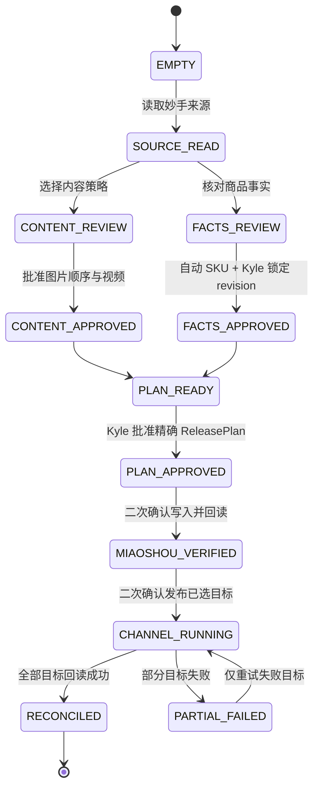
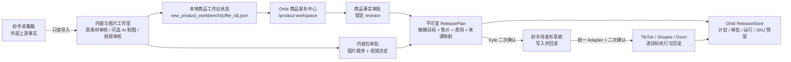

# Orbit 商品发布中心 V1

## 产品目标

V1 是 Kyle 实际使用的正式商品发布中心，不是测试台或旧工作台套壳。它在一个页面中呈现商品事实、内容、售价、渠道范围、批准和逐目标执行账本；内容与图片工作室可在新标签页并行打开。

AI 制图不是前置条件。内容包可以是 `source_only`（原素材直发）或 `ai_assisted`，两种策略都必须使用最终审核通过的图片顺序与视频决定。

## Kyle 实际操作流程

### 字段责任

| 信息 | 谁产生 | Kyle 的动作 | 正式页面当前行为 |
| --- | --- | --- | --- |
| Offer / 采集箱 ID | 妙手 | 输入要处理的商品 | 唯一需要在队列入口填写的身份 |
| Seller SKU | Orbit | 查看并在商品审批时确认 | 自动扫描目录和预留，不能手填 |
| 来源标题、图片、视频、规格 | 妙手 / 1688 | 核对、保留、移除或改写 | 只保留带来源证据的数据 |
| 采购成本、重量、包装尺寸 | 上游来源 + 工作台审核值 | 修改并最终批准 | 当前可展示和锁定；正式页编辑面板仍待补齐 |
| 内容策略 | Kyle | 选择原素材直发或 AI 辅助 | AI 制图不是必选步骤 |
| 发布平台与国家 | Kyle | 逐目标选择 | 16 个目标均可独立选择 |
| 售价、汇率、费用 | Orbit | 审查计算明细 | 系统计算，不要求 Kyle 手算 |
| 商品事实审批 | Kyle | 勾选并批准当前 revision | 只写本地审批事实 |
| ReleasePlan 审批 | Kyle | 核对精确目标和价格后批准 | 建立不可变计划和 SKU 预留 |
| 妙手同步 / 渠道发布 | Orbit 执行 | 每个外部阶段再次确认 | 默认关闭，确认后仍必须回读 |

### 从空白商品到发布完成

| 阶段 | Kyle 在页面上做什么 | 系统读取 | 系统产出 | 写入位置 | 外部副作用 |
| --- | --- | --- | --- | --- | --- |
| 0. 加入并行队列 | 只输入 Offer ID | 已有商品的只读摘要 | 带主图、标题、自动 Seller SKU 和当前阶段的队列卡片 | 浏览器本地队列 | 无 |
| 1. 读取来源 | 在内容工作室打开商品 | 妙手采集箱详情 | 来源标题、规格、图片、视频、成本/尺寸候选 | `*_miaoshou.json` 只读缓存 | 仅外部读取 |
| 2. 选择内容策略 | 选择 `source_only` 或 `ai_assisted` | 来源素材 | 内容处理路线 | 商品工作台 JSON | 无 |
| 3. 审核素材 | 决定图片顺序和视频保留；AI 路线可生成并逐图审核 | 原图或生成审计 | 最终 ContentPackage 候选 | 工作台 JSON + 本地套图产物 | AI 付费调用必须另行确认 |
| 4. 核对商品事实 | 核对标题、真实规格、成本、重量、包装 | 上游事实和人工修改 | ProductFacts revision | 工作台 JSON | 无 |
| 5. 自动分配 Seller SKU | 不输入 SKU，只看系统结果 | TikTok 目录序列、全目录占用、工作台锁、认领记录、ReleasePlan 预留 | 连续可用 SKU 候选段 | 只读计算 | 无 |
| 6. 批准内容和商品 | 分别批准内容包与商品事实 | 当前两个 revision | ContentApproval + ProductApproval | 工作台 JSON | 无 |
| 7. 选择渠道并审价 | 勾选 16 个目标的子集，检查每个国家/店铺售价 | 费用、汇率、成本、来源映射 | 渠道预检和价格审计 | 只读计算 | 无 |
| 8. 批准 ReleasePlan | 核对确认令牌后批准 | 商品、内容、目标、价格的精确版本 | 不可变 ReleasePlan + SKU reservation | `orbit_platform.db` | 无 |
| 9. 同步妙手待发布 | 再次勾选外部写入确认 | 已批准 ReleasePlan | 妙手公共草稿及逐字段回读 | ReleaseRun / TargetRun | 写妙手，不发布站点 |
| 10. 一键发布已选目标 | 再次勾选发布确认 | 妙手回读结果和统一渠道 Adapter | 每目标执行结果 | TargetRun 账本 | 只写所选渠道 |
| 11. 回读对账 | 查看结果，无需重新提交成功目标 | 渠道实际商品 | SUCCEEDED / PARTIAL_FAILED 事实 | ReleaseRun 账本 | 失败目标可单独重试 |

阶段 3 的内容审核和阶段 4–6 的商品事实审核可以在两个标签页并行进行；阶段 8 必须同时依赖两条线的已批准版本。

## 七阶段状态机

1. **商品事实**：显示标题、Seller SKU、成本、重量、包装、规格及每个值的来源。
2. **内容审批**：独立批准最终图片、顺序、文案和视频。
3. **商品审批**：Kyle 批准并锁定某个商品事实 revision。
4. **发布计划**：把商品审批、内容包、精确目标、来源映射、售价、汇率和费用绑定为不可变 `ReleasePlan`。
5. **妙手待发布**：独立确认后写入妙手公共草稿，并逐字段回读。
6. **渠道执行**：按依赖顺序执行所选店铺，单目标使用稳定幂等键。
7. **回读对账**：只有每个目标均回读验证成功，`ReleaseRun` 才能完成。

商品事实审批和内容审批互不包含。任一版本变化都会形成新的 ReleasePlan；旧计划被标记为 `SUPERSEDED`，不会被静默复用。

## 16 个发布目标

| 平台 | 店铺 / 国家 |
| --- | --- |
| 妙手 | COMMON 公共草稿 |
| TikTok Shop | LivelyHive PH / MY / TH / VN |
| TikTok Shop | HomeBloom PH / MY / TH / VN |
| TikTok Shop | MX |
| TikTok Shop | GB |
| Shopee | PH / MY / TH / VN |
| Ozon | RU |

默认范围保持 10 个目标：妙手、LivelyHive SEA 四国、Shopee SEA 四国和 Ozon RU。HomeBloom 四国、MX 与 GB 明确可选，但不会替用户默认打开。

Shopee 使用同国 TikTok 回读商品作为来源；同国同时选择 LivelyHive 和 HomeBloom 时，V1 明确优先 LivelyHive，并保留候选来源供审核。Ozon 按 PH、MY、TH、VN、MX、GB 选择主来源，同国优先 LivelyHive。

## 两个外部动作

### 同步到妙手待发布并回读

必须满足：

- 商品事实和内容包均已批准；
- 当前 ReleasePlan 已由 Kyle 批准；
- 页面提交精确 `plan_id`、确认令牌和目标集合；
- 用户再次勾选妙手写入确认。

成功只代表妙手待发布草稿与当前计划回读一致，不代表任何站点已发布。

### 一键发布已选店铺

必须满足：

- 妙手 COMMON TargetRun 已成功；
- 所选渠道都提供统一 V1 Adapter；
- Adapter 消费完整计划、验证确认令牌、保留幂等键并完成回读；
- 用户再次勾选发布确认。

当前仓库里的旧 TikTok、Shopee 和 Ozon 写入函数尚未同时满足以上统一合同，因此 production registry 明确标记为 `adapter_not_unified`。正式按钮保持关闭，后端也会返回结构化阻塞，不会退回旧函数或虚报成功。

## 数据与恢复

`shared_platform.release_store.ReleaseStore` 在 Orbit 平台库中持久化：

- `ReleasePlan`
- Kyle 的 `ReleaseApproval`
- `ReleaseRun`
- 每个目标的 `TargetRun`
- Seller SKU reservation

计划内容、摘要、批准身份、运行身份和目标幂等键由数据库约束和触发器保护。失败目标可重试，已成功目标不会重跑；废止计划保留历史事实。

## 当前真实运行架构

正式页面只读取可追溯的本地事实。内容工作室负责形成内容事实，商品发布中心负责商品审批、目标与售价、ReleasePlan 和受控外部执行；两者可以并行打开，但不互相伪造审批。

## 产品体验验收门禁

以后不能只证明“代码没报错”，还必须证明 Kyle 能完成任务：

1. **Kyle 任务模拟**：从空白浏览器开始，只给业务目标，不预填内部字段；脚本必须能走到下一明确动作。
2. **字段责任检查**：系统生成字段不得渲染为可编辑输入；当前门禁明确禁止 `seller_sku` 出现在正式页表单。
3. **状态转换测试**：EMPTY、待审核、双审批、计划批准、妙手回读、部分失败和完成状态均使用隔离 fixture 验证。
4. **并发冲突测试**：商品审批时重新扫描目录和全部预留；浏览器中的旧 SKU 候选必须返回冲突并要求刷新。
5. **正式页面浏览器验收**：桌面和手机宽度检查任务入口、反馈、错误恢复、按钮可用条件与控制台错误。
6. **外部副作用账本**：每个测试明确断言数据库写入、妙手写入、渠道写入和付费 AI 调用是否为零。
7. **真实流程文档同步**：每次交付同时更新本文件的字段责任、状态机、数据落点和当前缺口。

并行队列会在当前商品加载后，以最多 4 个只读请求并发补齐其他卡片；卡片主图优先使用 ContentPackage 的第一张已批准图片，否则使用来源预览图。缩略图统一通过 Orbit 图片代理读取，失败时只显示占位，不会把未审核图片写入发布计划。

## 3828540231 当前结论（2026-07-26 重置后）

该采集箱已回到 Orbit 本地初始化状态：

- 本地商品工作台状态不存在；
- 本地妙手读取缓存不存在；
- 本地 AI 图片套图产物不存在；
- 没有商品事实审批、内容包审批或 ReleasePlan；
- 商品主库与 Orbit 平台库没有该采集箱的发布记录；
- 正式页面的审批、妙手同步和渠道发布均保持禁用。

妙手采集箱的外部内容没有被本次本地重置修改。Kyle 从内容与图片工作室重新读取时，妙手当前内容会作为新的上游来源；读取本身不会认领、发布或写回商品。
