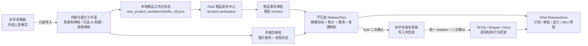

# Orbit 商品发布中心 V1

## 产品目标

V1 是 Kyle 实际使用的正式商品发布中心，不是测试台或旧工作台套壳。它在一个页面中呈现商品事实、内容、售价、渠道范围、批准和逐目标执行账本；内容与图片工作室可在新标签页并行打开。

AI 制图不是前置条件。内容包可以是 `source_only`（原素材直发）或 `ai_assisted`，两种策略都必须使用最终审核通过的图片顺序与视频决定。

## 七阶段状态机

1. **商品事实**：显示标题、Seller SKU、成本、重量、包装、规格及每个值的来源。
2. **内容审批**：独立批准最终图片、顺序、文案和视频。
3. **商品审批**：Kyle 批准并锁定某个商品事实 revision。
4. **发布计划**：把商品审批、内容包、精确目标、来源映射、售价、汇率和费用绑定为不可变 `ReleasePlan`。
5. **妙手待发布**：独立确认后写入妙手公共草稿，并逐字段回读。
6. **渠道执行**：按依赖顺序执行所选店铺，单目标使用稳定幂等键。
7. **回读对账**：只有每个目标均回读验证成功，`ReleaseRun` 才能完成。

商品事实审批和内容审批互不包含。任一版本变化都会形成新的 ReleasePlan；旧计划被标记为 `SUPERSEDED`，不会被静默复用。

## 16 个发布目标

| 平台 | 店铺 / 国家 |
| --- | --- |
| 妙手 | COMMON 公共草稿 |
| TikTok Shop | LivelyHive PH / MY / TH / VN |
| TikTok Shop | HomeBloom PH / MY / TH / VN |
| TikTok Shop | MX |
| TikTok Shop | GB |
| Shopee | PH / MY / TH / VN |
| Ozon | RU |

默认范围保持 10 个目标：妙手、LivelyHive SEA 四国、Shopee SEA 四国和 Ozon RU。HomeBloom 四国、MX 与 GB 明确可选，但不会替用户默认打开。

Shopee 使用同国 TikTok 回读商品作为来源；同国同时选择 LivelyHive 和 HomeBloom 时，V1 明确优先 LivelyHive，并保留候选来源供审核。Ozon 按 PH、MY、TH、VN、MX、GB 选择主来源，同国优先 LivelyHive。

## 两个外部动作

### 同步到妙手待发布并回读

必须满足：

- 商品事实和内容包均已批准；
- 当前 ReleasePlan 已由 Kyle 批准；
- 页面提交精确 `plan_id`、确认令牌和目标集合；
- 用户再次勾选妙手写入确认。

成功只代表妙手待发布草稿与当前计划回读一致，不代表任何站点已发布。

### 一键发布已选店铺

必须满足：

- 妙手 COMMON TargetRun 已成功；
- 所选渠道都提供统一 V1 Adapter；
- Adapter 消费完整计划、验证确认令牌、保留幂等键并完成回读；
- 用户再次勾选发布确认。

当前仓库里的旧 TikTok、Shopee 和 Ozon 写入函数尚未同时满足以上统一合同，因此 production registry 明确标记为 `adapter_not_unified`。正式按钮保持关闭，后端也会返回结构化阻塞，不会退回旧函数或虚报成功。

## 数据与恢复

`shared_platform.release_store.ReleaseStore` 在 Orbit 平台库中持久化：

- `ReleasePlan`
- Kyle 的 `ReleaseApproval`
- `ReleaseRun`
- 每个目标的 `TargetRun`
- Seller SKU reservation

计划内容、摘要、批准身份、运行身份和目标幂等键由数据库约束和触发器保护。失败目标可重试，已成功目标不会重跑；废止计划保留历史事实。

## 当前真实运行架构

正式页面只读取可追溯的本地事实。内容工作室负责形成内容事实，商品发布中心负责商品审批、目标与售价、ReleasePlan 和受控外部执行；两者可以并行打开，但不互相伪造审批。

## 3828540231 当前结论（2026-07-26 重置后）

该采集箱已回到 Orbit 本地初始化状态：

- 本地商品工作台状态不存在；
- 本地妙手读取缓存不存在；
- 本地 AI 图片套图产物不存在；
- 没有商品事实审批、内容包审批或 ReleasePlan；
- 商品主库与 Orbit 平台库没有该采集箱的发布记录；
- 正式页面的审批、妙手同步和渠道发布均保持禁用。

妙手采集箱的外部内容没有被本次本地重置修改。Kyle 从内容与图片工作室重新读取时，妙手当前内容会作为新的上游来源；读取本身不会认领、发布或写回商品。
