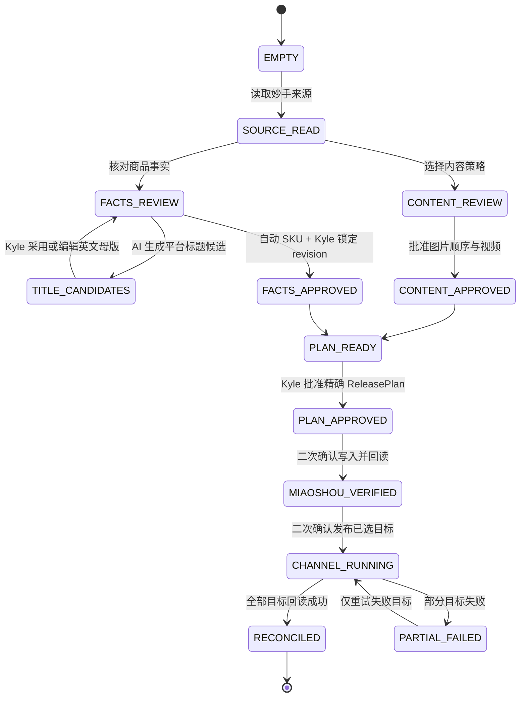
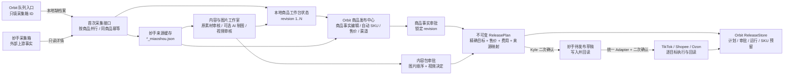

# Orbit 商品发布中心 V1

## 产品目标

V1 是 Kyle 实际使用的正式商品发布中心，不是测试台或旧工作台套壳。它在一个页面中呈现商品事实、内容、售价、渠道范围、批准和逐目标执行账本；内容与图片工作室可在新标签页并行打开。

AI 制图不是前置条件。内容包可以是 `source_only`（原素材直发）或 `ai_assisted`，两种策略都必须使用最终审核通过的图片顺序与视频决定。

## Kyle 实际操作流程

### 字段责任

| 信息 | 谁产生 | Kyle 的动作 | 正式页面当前行为 |
| --- | --- | --- | --- |
| Offer / 采集箱 ID | 妙手 | 输入要处理的商品 | 唯一需要在队列入口填写的身份 |
| Seller SKU | Orbit | 查看并在商品审批时确认 | 自动扫描目录和预留，不能手填 |
| 中文来源标题、图片、视频、规格 | 妙手 / 1688 | 核对来源真实性 | 中文来源标题保持不可变证据，不被模型产物冒充 |
| 正式英文标题与平台候选 | 内容域大模型 + 渠道规则 | 采用/编辑英文母版并审核平台候选 | DeepSeek 生成本地候选；不直接写妙手或渠道 |
| 采购成本、重量、包装尺寸 | 上游来源 + 工作台审核值 | 在商品事实原位修改并最终批准 | 单一事实面板编辑，保存为新 revision 并重算全部国家/店铺售价与预检 |
| 来源规格 | 妙手采集箱 | 勾选本次真实可采购规格 | 同页多选；未知规格和空选择被后端拒绝 |
| 内容策略 | Kyle | 选择原素材直发或 AI 辅助 | AI 制图不是必选步骤 |
| 发布平台与国家 | Kyle | 逐目标选择 | 16 个目标均可独立选择 |
| 售价、汇率、费用 | Orbit | 审查计算明细 | 系统计算，不要求 Kyle 手算 |
| 商品事实审批 | Kyle | 点击批准当前 revision | 单一明确动作，只写本地审批事实 |
| ReleasePlan 审批 | Kyle | 核对精确目标和价格后批准 | 建立不可变计划和 SKU 预留 |
| 妙手同步 / 渠道发布 | Orbit 执行 | 每个外部阶段再次确认 | 默认关闭，确认后仍必须回读 |

### 从空白商品到发布完成

| 阶段 | Kyle 在页面上做什么 | 系统读取 | 系统产出 | 写入位置 | 外部副作用 |
| --- | --- | --- | --- | --- | --- |
| 0. 加入并行队列 | 只输入 Offer / 采集箱 ID | 先查本地商品档案；缺失时立即只读妙手采集箱 | 队列进度、来源主图、标题、自动 Seller SKU 和当前阶段 | 浏览器队列 + `*_miaoshou.json` 只读缓存 + 首个 workbench revision | 仅外部读取 |
| 1. 建立商品档案 | 等待首次采集完成，不跳页 | 妙手来源标题、规格、图片、视频、成本、重量和包装候选 | 可编辑的 ProductFacts revision 1 | `new_product_workbench/{offer_id}.json` | 无外部写入 |
| 2. 选择内容策略 | 选择 `source_only` 或 `ai_assisted` | 来源素材 | 内容处理路线 | 商品工作台 JSON | 无 |
| 3. 审核素材 | 决定图片顺序和视频保留；AI 路线可生成并逐图审核 | 原图或生成审计 | 最终 ContentPackage 候选 | 工作台 JSON + 本地套图产物 | AI 付费调用必须另行确认 |
| 4. 核对商品事实 | 生成/编辑英文标题，编辑真实规格、成本、重量、包装长宽高并保存 | 中文来源事实、当前 revision 和人工修改 | 标题候选 + 下一 ProductFacts revision，同时刷新售价与渠道预检 | 工作台 JSON 原子写入 | 标题按钮只调用语言模型；无平台写入 |
| 5. 自动分配 Seller SKU | 不输入 SKU，只看系统结果 | TikTok 目录序列、全目录占用、工作台锁、认领记录、ReleasePlan 预留 | 连续可用 SKU 候选段 | 只读计算 | 无 |
| 6. 批准内容和商品 | 分别批准内容包与商品事实 | 当前两个 revision | ContentApproval + ProductApproval | 工作台 JSON | 无 |
| 7. 选择渠道并审价 | 勾选 16 个目标的子集，检查每个国家/店铺售价 | 费用、汇率、成本、来源映射 | 渠道预检和价格审计 | 只读计算 | 无 |
| 8. 批准 ReleasePlan | 核对确认令牌后批准 | 商品、内容、目标、价格的精确版本 | 不可变 ReleasePlan + SKU reservation | `orbit_platform.db` | 无 |
| 9. 同步妙手待发布 | 再次勾选外部写入确认 | 已批准 ReleasePlan | 妙手公共草稿及逐字段回读 | ReleaseRun / TargetRun | 写妙手，不发布站点 |
| 10. 一键发布已选目标 | 再次勾选发布确认 | 妙手回读结果和统一渠道 Adapter | 每目标执行结果 | TargetRun 账本 | 只写所选渠道 |
| 11. 回读对账 | 查看结果，无需重新提交成功目标 | 渠道实际商品 | SUCCEEDED / PARTIAL_FAILED 事实 | ReleaseRun 账本 | 失败目标可单独重试 |

阶段 2–3 的内容审核和阶段 4–6 的商品事实审核可以在两个标签页并行进行；首次采集和商品事实编辑始终留在正式发布中心。阶段 8 必须同时依赖两条线的已批准版本。

## 首次采集与事实编辑的精细行为

1. Kyle 在队列入口只输入数字采集箱 ID。
2. 页面先调用正式 dashboard；只有在本地档案确实不存在时才调用一次 `POST /api/product-workspace/collect`。
3. 服务端按 `offer_id` 加锁，不同商品可以并行采集；同一商品的重复点击会合并为幂等结果。
4. 采集接口只调用妙手详情读取，保存 `*_miaoshou.json` 来源缓存，并原子建立 workbench revision 1。
5. 首次档案保留来源标题、类目、成本、重量、包装尺寸、图片/视频决定候选、规格和汇率；不创建审批、不生成图片、不写妙手、不发布渠道。
6. 正式 dashboard 即使还没有图片审核包也必须打开：内容阶段显示待审核 blocker，但商品事实、自动 Seller SKU、主图预览和可编辑事实面板可正常工作。
7. 商品事实与编辑不再是两个重复界面：标题、成本、重量、包装尺寸和规格直接在同一事实面板修改；SKU 占用、类目、站点和来源证据保持只读。
8. 中文来源标题保持独立只读。`AI 生成平台标题` 使用中文来源、类目、尺寸、保留规格和已验证属性调用当前配置的大模型，保存带模型、规则版本、事实签名和时间的英文语义母版及 TikTok/Shopee/Ozon 平台候选；模型结果不会自动成为商品事实或平台草稿。
9. Kyle 采用或编辑英文语义母版后，点击“保存并确认商品事实 · 刷新全部售价”。编辑保存必须提交当前 `expected_revision`；后端校验英文标题、正数成本、正数重量、三个正数尺寸，以及所选规格确实属于当前来源。
10. 保存成功只建立下一本地 revision；页面必须使用该响应整体重绘商品事实、全部国家/店铺售价、费用审计和渠道预检，不能只替换表单数字。最终“批准并锁定 revision N”是独立动作，不再增加一个重复 checkbox。
11. 浏览器持有旧 revision、规格被来源移除或事实已被审批锁定时，保存返回明确冲突，不覆盖较新的事实；审批不可用时，真实 blocker 必须紧贴批准按钮显示，不能只把控件置灰。
12. AI 图片工作室始终可在新标签页并行打开；它负责内容版本，不负责首次商品建档。

## AI 图片工作室的真实细流程

1. 顶部项目卡同时显示 Offer ID、妙手公共采集箱 ID 和真实 1688 来源链接。妙手网页没有在本项目内验证过稳定的详情深链，因此入口只打开妙手正式站并把采集箱 ID 明示给 Kyle，不伪造页面路由；1688 只接受来源快照中的 `*.1688.com` HTTPS 链接。
2. 来源图和来源视频仍逐项人工决定。来源素材是否保留属于本次商品内容事实，不会因为 AI 规划而被覆盖。
3. Kyle 选择“仅来源图”或“AI 辅助套图”。AI 不是必选项；仅来源图路线关闭分镜、生图预检和付费生成。
4. AI 辅助路线先保存本次生成配方：场景图、卖点图、尺寸图数量及已核对尺寸。输入中的未保存配方是当前浏览器草稿；生成任务的后台轮询只能刷新任务状态，不得用服务端旧值静默覆盖草稿。
5. AI 根据已确认的商品事实、身份参考图和数量硬约束形成分镜。分镜是持续实践和版本化优化的经验配方，不再要求 Kyle 逐卡批准；当前有效 AI 方案由后端以 `experience_recipe_auto` 兼容记录标记为已采用。
6. 配方数量、尺寸、身份参考或事实范围发生变化时，旧 AI 方案和旧生成预检立即失效，必须按新配方重新规划，不能静默复用。
7. 付费生图前仍有独立的无费用预检和明确的费用确认。预检检查事实/配方签名、HTTPS 身份参考、类目与精确数量、尺寸图人工尺寸、任务 payload 和并发付费任务；正常流程由 AI 规划自动运行。通过后隐藏重复按钮，仅在失败或输入过期时显示重新检查入口。
8. 每个真实生成版本只保留一个人工决定：待定、通过并保留、返工且不保留、拒绝且不保留。只有技术验证通过且选择“通过并保留”的当前版本可以进入最终图片集；不再要求 Kyle 再选一次“进入最终图片”。
9. 最终图片顺序先保存本地；同步妙手是单独的外部写入动作，必须再次勾选确认，并显示逐步骤进度和写后回读结果。
10. 内容包只在来源决定、当前成图决定、最终顺序和相关版本事实完整时批准。任何配方或图片版本更新都会使旧同步结果变为过期事实。
11. AI 规划按钮明确标注“不生成图片”。点击后必须就地显示“保存配方 → AI 规划 → 自动采用 → 无费用生成前检查”四阶段；完成后停在“等待 Kyle 确认付费”，不得让 `not_started` 文案覆盖已经 ready 的 preflight。
12. 只有 Kyle 点击“确认付费并生成 N 张”后才建立图片任务。生成区随后按排队、逐图生成、完成/部分失败、成图审核显示进度；规划和预检阶段的外部图片任务数必须为零。

## 七阶段状态机

1. **商品事实**：显示标题、Seller SKU、成本、重量、包装、规格及每个值的来源。
2. **内容审批**：独立批准最终图片、顺序、文案和视频。
3. **商品审批**：Kyle 批准并锁定某个商品事实 revision。
4. **发布计划**：把商品审批、内容包、精确目标、来源映射、售价、汇率和费用绑定为不可变 `ReleasePlan`。
5. **妙手待发布**：独立确认后写入妙手公共草稿，并逐字段回读。
6. **渠道执行**：按依赖顺序执行所选店铺，单目标使用稳定幂等键。
7. **回读对账**：只有每个目标均回读验证成功，`ReleaseRun` 才能完成。

商品事实审批和内容审批互不包含。任一版本变化都会形成新的 ReleasePlan；旧计划被标记为 `SUPERSEDED`，不会被静默复用。

## 16 个发布目标

| 平台 | 店铺 / 国家 |
| --- | --- |
| 妙手 | COMMON 公共草稿 |
| TikTok Shop | LivelyHive PH / MY / TH / VN |
| TikTok Shop | HomeBloom PH / MY / TH / VN |
| TikTok Shop | MX |
| TikTok Shop | GB |
| Shopee | PH / MY / TH / VN |
| Ozon | RU |

默认范围保持 10 个目标：妙手、LivelyHive SEA 四国、Shopee SEA 四国和 Ozon RU。HomeBloom 四国、MX 与 GB 明确可选，但不会替用户默认打开。

Shopee 使用同国 TikTok 回读商品作为来源；同国同时选择 LivelyHive 和 HomeBloom 时，V1 明确优先 LivelyHive，并保留候选来源供审核。Ozon 按 PH、MY、TH、VN、MX、GB 选择主来源，同国优先 LivelyHive。

## 两个外部动作

### 同步到妙手待发布并回读

必须满足：

- 商品事实和内容包均已批准；
- 当前 ReleasePlan 已由 Kyle 批准；
- 页面提交精确 `plan_id`、确认令牌和目标集合；
- 用户再次勾选妙手写入确认。

成功只代表妙手待发布草稿与当前计划回读一致，不代表任何站点已发布。

### 一键发布已选店铺

必须满足：

- 妙手 COMMON TargetRun 已成功；
- 所选渠道都提供统一 V1 Adapter；
- Adapter 消费完整计划、验证确认令牌、保留幂等键并完成回读；
- 用户再次勾选发布确认。

当前仓库里的旧 TikTok、Shopee 和 Ozon 写入函数尚未同时满足以上统一合同，因此 production registry 明确标记为 `adapter_not_unified`。正式按钮保持关闭，后端也会返回结构化阻塞，不会退回旧函数或虚报成功。

## 数据与恢复

`shared_platform.release_store.ReleaseStore` 在 Orbit 平台库中持久化：

- `ReleasePlan`
- Kyle 的 `ReleaseApproval`
- `ReleaseRun`
- 每个目标的 `TargetRun`
- Seller SKU reservation

计划内容、摘要、批准身份、运行身份和目标幂等键由数据库约束和触发器保护。失败目标可重试，已成功目标不会重跑；废止计划保留历史事实。

## 当前真实运行架构

正式页面只读取或修改可追溯的本地商品事实；商品修改必须生成新 revision。内容工作室负责形成内容事实，商品发布中心负责首次采集、商品编辑与审批、目标与售价、ReleasePlan 和受控外部执行；两者可以并行打开，但不互相伪造审批。

## 产品体验验收门禁

以后不能只证明“代码没报错”，还必须证明 Kyle 能完成任务：

1. **Kyle 任务模拟**：从空白浏览器开始，只给业务目标，不预填内部字段；脚本必须能走到下一明确动作。
2. **字段责任检查**：系统生成字段不得渲染为可编辑输入；当前门禁明确禁止 `seller_sku` 出现在正式页表单。
3. **状态转换测试**：EMPTY、待审核、双审批、计划批准、妙手回读、部分失败和完成状态均使用隔离 fixture 验证。
4. **并发冲突测试**：商品审批时重新扫描目录和全部预留；浏览器中的旧 SKU 候选必须返回冲突并要求刷新。
5. **正式页面浏览器验收**：桌面和手机宽度检查任务入口、反馈、错误恢复、按钮可用条件与控制台错误。
6. **外部副作用账本**：每个测试明确断言数据库写入、妙手写入、渠道写入和付费 AI 调用是否为零。
7. **真实流程文档同步**：每次交付同时更新本文件的字段责任、状态机、数据落点和当前缺口。

并行队列会在当前商品加载后，以最多 4 个只读请求并发补齐其他卡片；卡片主图优先使用 ContentPackage 的第一张已批准图片，否则使用来源预览图。缩略图统一通过 Orbit 图片代理读取，失败时只显示占位，不会把未审核图片写入发布计划。

## 3828540231 当前结论（2026-07-26 正式首次采集后）

该采集箱已经进入正式商品发布中心，并经过多轮内容操作：

- 本地妙手来源缓存已由只读详情接口重新建立；
- 本地商品工作台当前为 revision 40；
- 来源商品为 `BB6102` 水彩花卉蝴蝶墙贴，正式页已显示来源主图；
- 系统自动 Seller SKU 候选为 `0952`，Kyle 无需也不能手填；
- 标题、成本、重量、包装尺寸和两条来源规格已进入同页编辑面板；正式英文标题仍是中文来源标题，采购成本为 `9 CNY`，但当前保留规格证据为 `8.1 CNY`，这两项是商品审批的真实 blocker；
- 内容包已批准，共 8 张最终图片，当前图片集已通过妙手回读；
- AI 规划生成 `sc1` 场景图与 `sp1` 卖点图，经验配方与无费用预检有效；两项付费任务均已完成技术核验，当前状态是 `completed_waiting_human_review`；
- 成图卡现只保留一个图片决定，“通过并保留”同时表达批准和进入最终集；当前 `sc1_r5` 与 `sp1_r5` 均为“通过并保留”，与已批准 8 图内容包一致；
- 新品标题生成入口已接入正式页，但 2026-07-26 的真实调用发现现有 DeepSeek Key 返回 401；失败被原位显示，没有改动商品标题或 revision，也没有妙手/渠道写入。更新有效兼容 Key 后可直接重试；
- 没有 ProductApproval 或 ReleasePlan；渠道发布保持禁用。

下一步是更新有效的大模型 Key 后生成并采用英文语义母版，同时把采购成本核对为当前保留规格的 `8.1 CNY`（或更换/补充能证明 `9 CNY` 的规格证据），再点击“保存并确认商品事实 · 刷新全部售价”。保存形成 revision 41 后，Kyle 可使用单一“批准并锁定 revision 41”动作；内容与图片工作室仍可在另一标签页并行完成两张成图决定。
