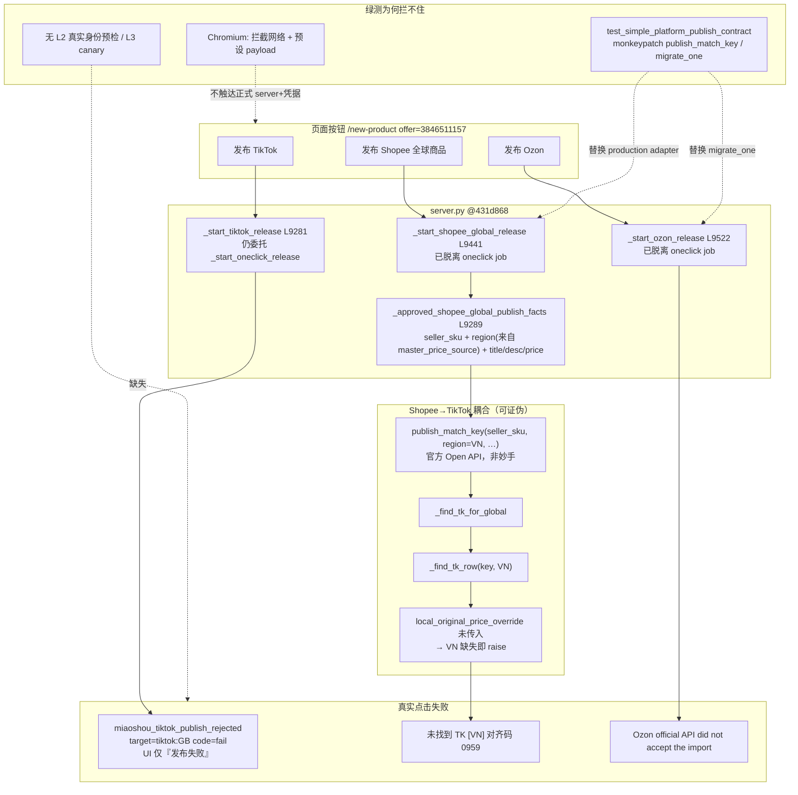

# 自动上品代码级只读审计报告

审计日期：2026-08-03

审计基线：`431d868 Isolate Shopee and Ozon publish paths`

输入交接包：`docs/audits/AUTO_LISTING_TWO_WEEK_AUDIT_HANDOFF_2026-08-03.md`

复现商品：`offer_id=3846511157`

审计边界：只读。未修改代码、未写生产 DB、未调用真实发布/修改/删除接口。工作树 HEAD 可能已超前基线；本报告结论均以 `git show 431d868:...` 为准。

---

## 0. 一句话结论

三按钮全挂的主因不是「少一个 if」，而是：**渠道真实合同未冻结 + fixture 绿测替代真实可用性**；其中 Shopee 失败可精确定位为 **全球发布主路径仍硬依赖 TikTok `[region]` 目录行**，与「Shopee 不依赖 TikTok」冲突。

---

## 1. 代码级根因图



### 1.1 三条失败的代码级解释

| 平台 | 入口 @431d868 | 失败机制 |
| --- | --- | --- |
| **Shopee** | `_start_shopee_global_release` → `publish_match_key(0959, region=facts.region)` | `facts.region` 来自 `pricing.master_price_source`（实测为 **VN**）。即便已传入 title/desc/price override，仍执行 `_find_tk_row(key, VN)`；缺 VN 行且 **未传** `local_original_price_override` → 精确报错 `未找到 TK [VN] 对齐码 0959`。与「Shopee 不依赖 TikTok」冲突。另：走的是 **官方** `modules.shopee.publish`，不是妙手 CNSC。 |
| **TikTok** | 仍 `_start_oneclick_release(..., TIKTOK)` | 「按钮隔离」未完成：仍吃 oneclick/collectbox 路径。GB 被妙手 `code=fail`；handler/日志未把 `provider_code` 安全映射到页面 → UI 丢细节。 |
| **Ozon** | `migrate_one(..., wait_for_import=False)` | 接受条件：`ok` 或 (`task_id` ∧ `import_dispatch_outcome==accepted`) 且无 `errors`。真实 envelope 不满足 → 统一文案 `did not accept`；无脱敏成功 fixture 对照。 |

### 1.2 方法层根因

1. 在渠道最小合同未稳前堆控制面，再拆除；`431d868` 只切开 Shopee/Ozon 的 **job 入口**，未切开 Shopee 的 **身份数据源**。
2. L1 fixture 证明「假 transport 自洽」，无按钮→production adapter→当前 offer 的纵向门禁。
3. 文档 / `TRACEABILITY` 仍把 PRD-004「三平台妙手」标为 CURRENT，与对话决定及 `431d868` 中 Ozon/Shopee 实现不一致。

### 1.3 基线关键入口（行号随后续提交会变，复核用 `rg`）

| 功能 | 路径 |
| --- | --- |
| TikTok 按钮 | `modules/products/server.py::_start_tiktok_release`（约 L9281） |
| Shopee approved facts | `::_approved_shopee_global_publish_facts`（约 L9289） |
| Ozon approved facts | `::_approved_ozon_publish_facts`（约 L9353） |
| 安全错误摘要 | `::_safe_platform_publish_error`（约 L9418） |
| Shopee 全球按钮 | `::_start_shopee_global_release`（约 L9441） |
| Ozon 按钮 | `::_start_ozon_release`（约 L9522） |
| Shopee 主发布 | `modules/shopee/publish.py::publish_match_key` |
| Ozon 导入 | `modules/ozon/migrate_batch.py::migrate_one` |

---

## 2. 需求 — 代码 — 测试差异矩阵

| ID | 当前有效需求（handoff §7.1） | 代码 @431d868 | 测试 @431d868 | 差异 |
| --- | --- | --- | --- | --- |
| R1 | 三平台完全独立 | 路由/锁分开；TikTok 仍进 oneclick；Shopee 读 TK 目录 | 有「不进 shared job」断言；**无**「不读 TK row」断言 | **GAP**：隔离不完整 |
| R2 | 每次点击新尝试，历史不阻断 | Shopee/Ozon 独立锁；TikTok 仍受 oneclick/历史语义影响 | 前端四态/不轮询有测；历史准入未彻底清 | **PARTIAL** |
| R3 | TikTok=妙手，计划内目标 | `_start_tiktok_release`→oneclick/妙手 | fake Miaoshou `result=success` | **L1 only**；无 GB 真实拒绝 envelope |
| R4 | Shopee=**妙手**，仅 CNSC 全球 | 调 **`publish_match_key`（官方 API）** | fake 官方 `publish_match_key` 返回 ok | **需求/代码双错位**；测在固化错误实现 |
| R5 | Shopee 不依赖 TikTok 身份 | 硬依赖 `_find_tk_*` + `region` | fixture `region=PH` 且整函数被 mock | **P0 GAP**；真实 VN+0959 未进门禁 |
| R6 | Ozon=官方 API 直接提交 | `migrate_one` 官方路径 | fake accepted envelope | **L1 only**；真实 accept 合同未冻结 |
| R7 | 明确拒绝→安全具体可重试原因 | `_safe_platform_publish_error` 有；TikTok UI 仍泛化 | 有 redact 测；无「GB code=fail 上屏」 | **GAP** 可观测性 |
| R8 | 不把人工验收/回读当完成条件 | Shopee/Ozon 按钮路径基本如此 | Chromium 合同态 | **OK（按钮层）** |
| Doc | PRD-004 三平台妙手 | Ozon 已官方；Shopee 也官方 | TRACEABILITY 仍标 CURRENT | **文档过期** |

### 2.1 为何 109 / 1995 绿仍可三平台红

- Shopee 测：`monkeypatch.setattr("modules.shopee.publish.publish_match_key", fake_publish)` → **永不执行** `_find_tk_row`。
- Ozon 测：整段 `migrate_one` 假返回。
- Chromium：`ORBIT_BROWSER_CONTRACT_ONLY` + 拦截网络。
- 交付门禁无：当前 `offer_id` 的 `seller_sku/region`、TK 行是否存在、token、真实 envelope。

### 2.2 Shopee 关键耦合代码（基线行为）

```text
publish_match_key:
  tk_row, tk_detail, tk_source = _find_tk_for_global(key, reg)
  try:
      row = _find_tk_row(key, reg)
      regional_detail = _fetch_tk_detail(row)
  except RuntimeError:
      if local_original_price_override is None:
          raise   # ← 真实失败点：VN 缺失 + override 未传
```

Handler `_start_shopee_global_release` 传入了 `title_override` / `description_override` / `global_original_price_cny_override`，但 **未传** `local_original_price_override`，因此区域 TK 行仍是硬门槛。

---

## 3. 旧层处置建议

| 层 | 建议 |
| --- | --- |
| `_start_shopee/ozon_release` 独立锁与 facts 抽取 | **保留** |
| `publish_match_key` 作 Shopee 按钮后端 | **旁路**：与「妙手 CNSC」不符；短期可修 TK 耦合作止血，中期换 Miaoshou publisher |
| `_find_tk_row` / `_find_tk_for_global` 在全球发布主路径 | **删除/禁止**作为硬依赖；图片/母版应从 approved plan 或显式资产字段来 |
| `_start_tiktok_release`→oneclick | **旁路**：抽 `TikTokPublisher`，oneclick 仅兼容 |
| 重型 reconciliation / manual acceptance 准入 | **冻结新增**；按钮路径旁路 |
| 过期 oneclick MX/HomeBloom 边界测（全仓 8 fail） | **迁移或标 obsolete**，勿为绿测改语义 |
| PRD-004 / TRACEABILITY CURRENT | **supersession 记录**后改写 |

---

## 4. 三条最小发布器（建议接口，本审计不实现）

```text
TikTokPublisher.publish(approved_plan, targets) -> PublishReceipt
ShopeeGlobalPublisher.publish(approved_plan) -> PublishReceipt
OzonPublisher.publish(approved_plan) -> PublishReceipt
```

`PublishReceipt` 最小字段：

```json
{
  "accepted": true,
  "platform": "TIKTOK",
  "target": "tiktok:GB",
  "request_digest": "sha256...",
  "provider_code": "redacted-code",
  "safe_message": "..."
}
```

约束：不得读取另一平台身份字段或状态表。

### 验收分层（禁止跨层宣称）

1. **L1 离线合同**：0 外部写；含「无 TK row 调用」类断言。
2. **L2 真实只读预检**：当前 offer、凭据、目标对象存在性。
3. **L3 受控 canary**：Kyle 明确授权后单写者执行；保存安全回执。

L3 未执行时只能称「代码候选」，不能称「发布已修复」。

---

## 5. 第一个最小修复任务草案（暂不执行）

### WO-AUDIT-001 — 切断 Shopee 全球按钮对 `TK[region]` 行的硬失败

**目标**：复现日志 `未找到 TK [VN] 对齐码 0959` 在「approved facts 齐全」时不再发生；且 **L1 红测先失败再变绿**。

**范围（最小）**

1. `_start_shopee_global_release`：在已有 title/desc/`global_original_price_cny` 时，向 `publish_match_key` 传入足以跳过区域 TK 行校验的 override（或等价 `skip_regional_tk_row=True`）。
2. `publish_match_key`：当全球文案+全球价均来自 override 时，**禁止**因 `_find_tk_row(region)` 失败而 abort；不得用猜价格填补。
3. **新红测**（不得 mock 掉整函数）：approved facts + `region=VN` + **无** `products` VN 行 → handler/`publish_match_key` 不得抛 `未找到 TK [VN]`；断言未调用或可容忍缺失的 regional row。
4. 断言：不启动 `publish_shops`、不进 `_start_oneclick_release`。

**非目标（本 WO 不做）**

- 改接到妙手 CNSC；
- 修 GB `code=fail`；
- 改 Ozon envelope；
- 删 oneclick。

**验收**

- L1：上述红→绿；现有 `test_shopee_button_uses_approved_plan_*` 仍过。
- L2（只读）：对 `3846511157` 打印将调用的 `match_key/region/overrides` 与「是否仍查询 TK[VN]」。
- L3：本 WO **不授权**真实写入。

**风险**：仍走官方 Open API，与「Shopee=妙手」尚未对齐——标为 **止血**；后续 WO-002 再换 Miaoshou publisher。

### 建议后续排序（仅索引）

| WO | 主题 |
| --- | --- |
| WO-AUDIT-002 | TikTok：`code=fail` / `provider_code` 安全上屏；GB 失败不挡其他站 |
| WO-AUDIT-003 | Ozon：冻结真实 accept/reject 脱敏 fixture，收紧 `accepted` 判定 |
| WO-AUDIT-004 | 文档 supersession：PRD-004 / TRACEABILITY 与对话决定对齐 |

---

## 6. 主假设复核

交接包假设：

> 当前主要问题不是某一个 if/字段错误，而是系统在渠道真实合同未冻结、需求仍快速变化、且缺少受控真实写入验收的情况下，过早建设了跨渠道统一控制面；随后又通过大量 fixture 测试证明内部自洽，却没有证明 production adapter 对当前商品和当前平台可用。

**复核结论：成立。**

`431d868` 证明了「job 隔离」可测绿，但 Shopee 仍把 `master_price_source.region` 绑到 TikTok 目录查找；测试用假 `publish_match_key` 掩盖了该路径。正确下一步是执行 WO-AUDIT-001 的红测设计与最小止血，而不是继续散弹补丁。

---

## 7. 复核命令

```powershell
git rev-parse 431d868
git show 431d868:modules/products/server.py | rg -n "_start_tiktok_release|_start_shopee_global|_start_ozon|_approved_shopee|_find_tk"
git show 431d868:modules/shopee/publish.py | rg -n "def publish_match_key|_find_tk_row|local_original_price_override"
git show 431d868:tests/test_simple_platform_publish_contract.py | rg -n "publish_match_key|migrate_one|monkeypatch"
```

---

## 8. 关联材料

- 交接包：`docs/audits/AUTO_LISTING_TWO_WEEK_AUDIT_HANDOFF_2026-08-03.md`
- 需求/追溯（可能过期）：`docs/release_v2/PRODUCT_REQUIREMENTS.md`、`docs/release_v2/TRACEABILITY.md`
- 安全日志抄录（handoff §0）：TikTok GB `code=fail`；Shopee `未找到 TK [VN] 对齐码 0959`；Ozon `did not accept the import`
