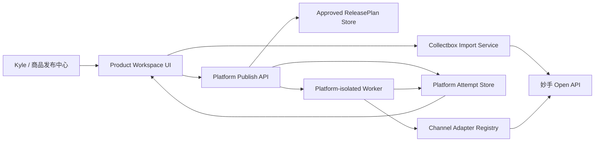
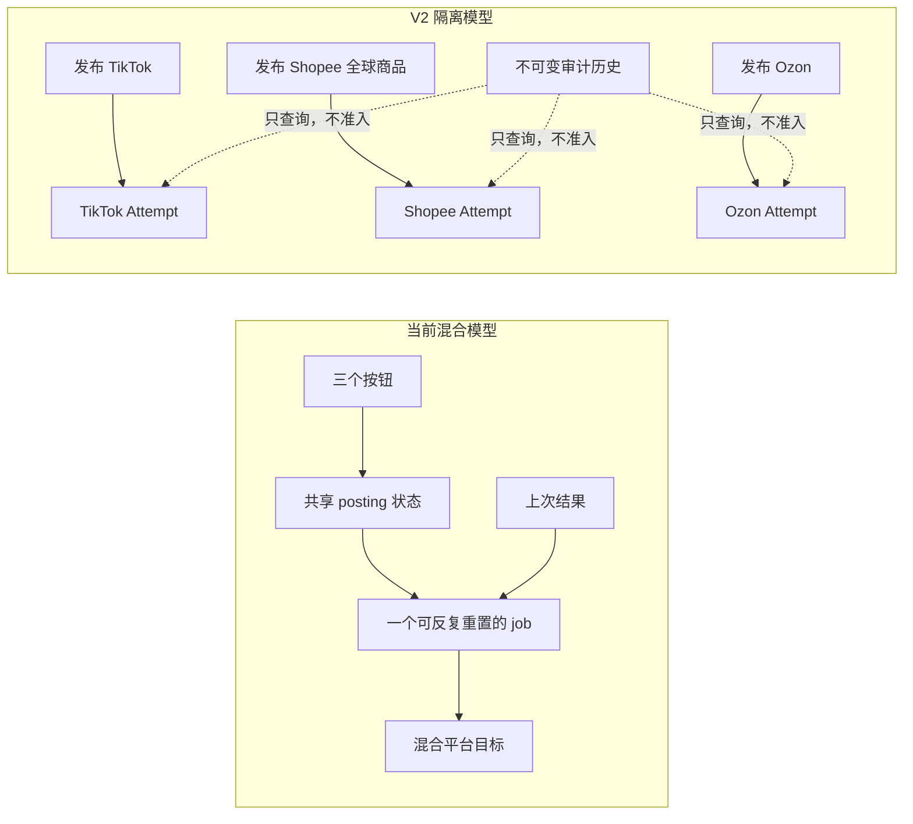
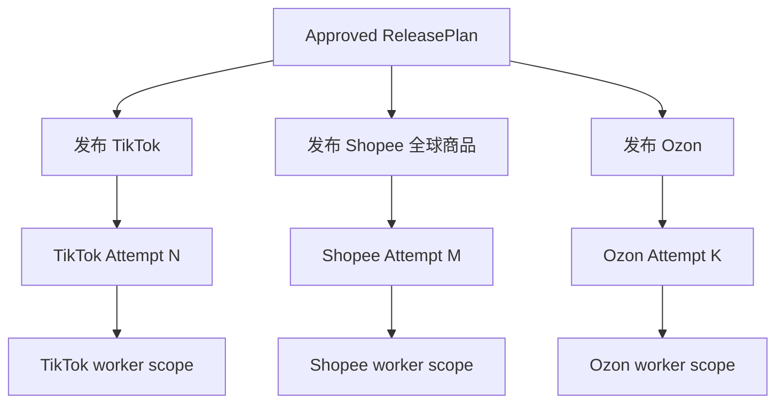
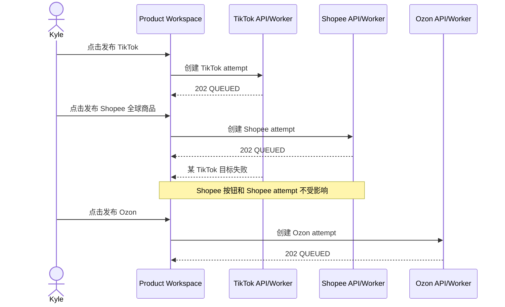
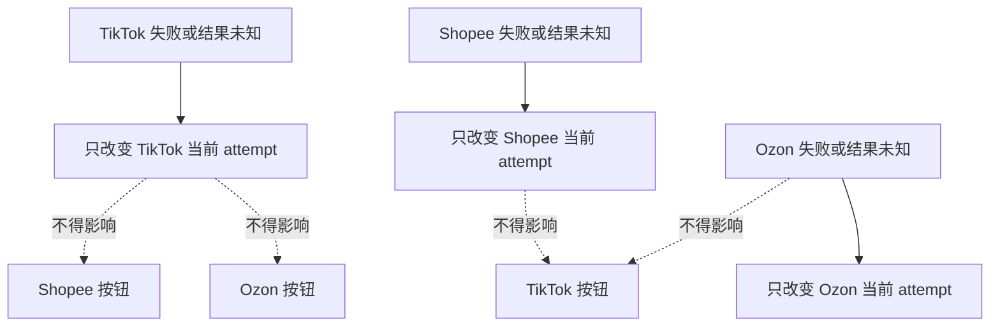
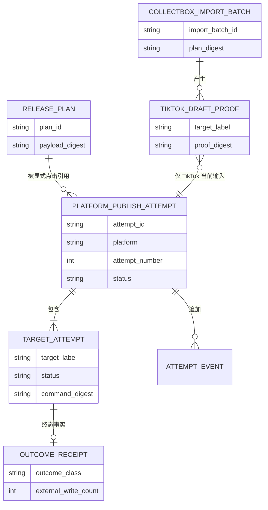
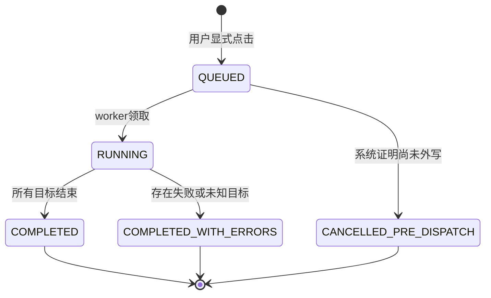
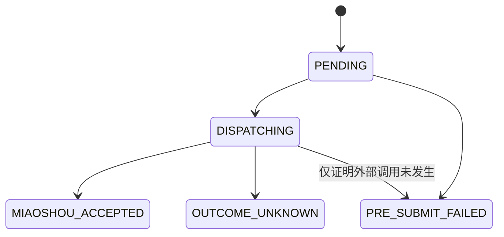
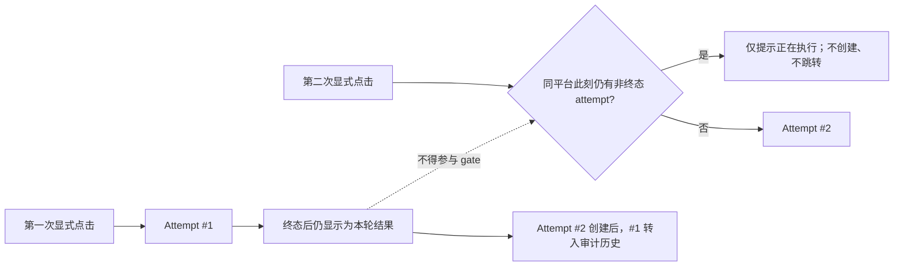

# 自动上品发布 V2：软件架构说明书

> **DEPRECATED / 历史架构：** 本文描述迁移前的 V2 状态机。当前写入只走
> 三个平台独立 Runner；详见
> [LEGACY_PUBLICATION_RETIREMENT.md](LEGACY_PUBLICATION_RETIREMENT.md)。

状态：`DRAFT_FOR_KYLE_REVIEW`

## 1. 架构目标

架构必须直接保障以下产品不变量：

1. 三个平台互相隔离；
2. 每次显式点击产生新尝试；
3. 历史不可变但不参与新尝试准入；
4. 同平台同一时刻只有一个执行中尝试；
5. 单目标失败不终止后续目标；
6. 服务重启后不丢失尝试，也不自动重复外部提交；
7. UI 不自行推导业务状态，以服务端投影为准；
8. 妙手凭据和原始响应不进入公开状态。

## 2. 上下文

### 2.1 V2 相对当前实现的结构变化

这张图表达唯一关键变化：历史不再和当前执行共用一个可变对象，三个平台也不再共用业务 busy 状态。

## 3. 组件职责

### 3.1 Product Workspace UI

- 展示已批准计划摘要；
- 提供三个独立平台按钮；
- 提供重新导入采集箱操作；
- 为每次点击生成客户端请求 ID；
- 展示当前平台尝试；
- 独立展示历史；
- 不根据旧目标状态决定新按钮是否可用。

UI 不负责：

- 选择需要重试的旧目标；
- 合并历史结果为新准入规则；
- 在浏览器循环调用每个店铺；
- 判断妙手是否已实际写入；
- 保存任何凭据。

### 3.2 Platform Publish API

三个命令入口：

- `POST /api/product-workspace/publish-tiktok`
- `POST /api/product-workspace/publish-shopee-global`
- `POST /api/product-workspace/publish-ozon`

每个入口只负责：

1. 重建已批准计划身份；
2. 校验该平台自身前置条件；
3. 检查该平台是否存在执行中尝试；
4. 创建或返回该平台当前尝试；
5. 唤醒后台执行；
6. 在任何渠道 I/O 前返回持久接受回执。

API 不得查询其他平台历史来决定是否接受。

### 3.3 Approved ReleasePlan Store

持有不可变执行输入：

- 商品与 revision；
- Seller SKU 与 model SKU；
- 内容与图片顺序；
- 平台目标；
- 逐目标价格；
- 逐目标类目决定；
- 重量、尺寸和其他平台字段；
- 审批者与确认令牌摘要。

发布尝试永远引用计划，不复制一个可被 UI 修改的新版本。

### 3.4 Collectbox Import Service

负责公共采集箱到妙手平台草稿的准备。每次重新导入创建新的 `CollectboxImportBatch`。

TikTok 输出逐目标内部证明：

- `target_label`
- `detail_id`
- `shop_id`
- `plan_digest`
- `import_batch_id`
- `proof_digest`

公开投影只返回摘要，不返回内部妙手 ID。

### 3.5 Platform Attempt Store

目标模型不再以“一份可反复覆盖的 job 当前行”同时充当历史和当前状态，而是明确分为：

- `PlatformPublishAttempt`：一次用户点击；
- `TargetAttempt`：本次点击中的单目标执行；
- `AttemptEvent`：追加事件；
- `OutcomeReceipt`：不可变终态事实。

历史查询和当前尝试查询使用不同接口。

### 3.6 Platform-isolated Worker

Worker 按 `attempt_id` 工作，一次只消费一个平台：

- TikTok attempt 只包含 TikTok 目标；
- Shopee attempt 只包含 `shopee:GLOBAL`；
- Ozon attempt 只包含 `ozon:RU`。

Worker 在单目标失败后继续下一目标。它不自动创建下一次 attempt。

### 3.7 Channel Adapter Registry

渠道域是所有外部平台写入的唯一执行者。Adapter 接收服务端持久化的 JSON-only command，并返回有类型的结果：

- 明确接受；
- 明确提交前失败；
- 提交结果未知。

Adapter 不写平台控制数据库，不决定 UI 文案，不读取其他平台状态。

## 4. 平台隔离模型

### 4.1 并行点击与故障半径

允许共享已批准输入和底层数据库连接，但禁止共享以下运行控制：

- `posting` 锁；
- 当前 attempt ID；
- 当前状态；
- 当前错误；
- 目标队列；
- 按钮禁用理由；
- 历史结果准入判断。

## 5. 数据模型

### 5.1 PlatformPublishAttempt

| 字段 | 类型 | 说明 |
| --- | --- | --- |
| `attempt_id` | string | 不可变唯一 ID |
| `platform` | enum | `TIKTOK` / `SHOPEE_GLOBAL` / `OZON` |
| `attempt_number` | int | 同计划同平台从 1 递增 |
| `plan_id` | string | 已批准计划 |
| `offer_id` | string | 商品身份 |
| `request_id` | string | 一次点击的请求幂等键 |
| `target_set_digest` | sha256 | 本次目标集合 |
| `input_proof_digest` | sha256/null | TikTok 草稿或平台准备证明 |
| `status` | enum | 当前 attempt 状态 |
| `created_at` | datetime | 创建时间 |
| `started_at` | datetime/null | 开始执行 |
| `completed_at` | datetime/null | 进入终态 |

### 5.2 TargetAttempt

主键：`(attempt_id, target_label)`。

| 字段 | 说明 |
| --- | --- |
| `ordinal` | 本次执行顺序 |
| `status` | 单目标当前状态 |
| `command_digest` | 服务端准备命令摘要 |
| `external_write_count` | 明确写入数或 null |
| `write_lower_bound` | 已确认最少写入数 |
| `write_upper_bound` | 最大可能写入数或 null |
| `reason_code` | 稳定错误/结果码 |
| `result_digest` | 红化结果摘要 |

### 5.3 OutcomeReceipt

主键：`(attempt_id, target_label)`，终态后不可修改。保存红化事实、写入计数、结果类别和证据摘要，不保存凭据、原始响应、标题、图片 URL 或妙手内部 ID。

### 5.4 数据所有权关系

## 6. 状态模型

### 6.1 Attempt 状态

所有终态都允许用户通过下一次点击创建新的 attempt。

### 6.2 Target 状态

不存在从旧 attempt 的终态回到 `PENDING` 的转换；新点击创建新行。

### 6.3 “上一次”与“下一次”

最近一次 completed attempt 在下一次 attempt 创建前，仍作为“本轮结果”投影给主页面；它只用于展示，不参与新尝试准入。更早的 completed attempts 只服务历史展示。新尝试准入只读取：

- 当前计划；
- 当前平台目标；
- 当前平台输入证明；
- 当前平台是否存在非终态 attempt。

不得读取历史终态作为布尔 gate。

## 7. 并发与幂等

### 7.1 锁粒度

锁键：`(plan_id, platform)`。

不能使用一个全局 `_release_execution_lock` 或一个浏览器全局 `posting` 状态同时锁住三平台。底层 SQLite 写事务可以串行，但业务准入必须保持平台隔离。

### 7.2 请求幂等

一次按钮点击生成一个 `request_id`：

- 相同 `request_id` 重放：返回同一 attempt；
- 新 `request_id` 且无执行中 attempt：创建新 attempt；
- 新 `request_id` 但同平台仍执行：返回 `409 PLATFORM_ATTEMPT_IN_PROGRESS` 和现有 attempt；
- 历史 attempt 不参与上述判断。

前端收到 `PLATFORM_ATTEMPT_IN_PROGRESS` 后只显示可见提示；不聚焦、不跳转、不打开历史或详情。响应中的 attempt 引用仅用于诊断和后续状态刷新。

### 7.3 Worker 恢复

服务启动时：

- `QUEUED` 可继续领取；
- 已持久化外部调用意图但结果未知的 `DISPATCHING` 目标转为 `OUTCOME_UNKNOWN`，不得自动重发；
- 未记录任何外部调用意图的目标可安全回到 `PENDING`；
- attempt 收敛后按钮重新开放。

## 8. API 边界

### 8.1 命令与查询分离

命令：三个 POST 平台入口、一个采集箱重新导入入口。

查询：按平台读取当前 attempt，按平台分页读取历史。

建议查询接口：

- `GET /api/product-workspace/platform-publish-current?plan_id=...&platform=...`
- `GET /api/product-workspace/platform-publish-history?plan_id=...&platform=...&limit=...`

当前 `/publish-status` 的混合 job 投影可在兼容期保留，但不得继续作为 V2 UI 的唯一状态源。

历史接口属于审计能力。主发布页面默认不调用它来显示条数、横幅或“上次”分组；只有明确进入审计视图时才查询。

## 9. 安全和审计

- 妙手 token 仅存在服务端运行环境；
- 浏览器不能提交 detail ID、shop ID、prepared command 或 adapter receipt；
- 所有外部写入由渠道域 adapter 执行；
- API 接受回执必须声明此时外部写入数为 0；
- Worker 结果明确记录写入类别和上下界；
- 公开错误只包含稳定 code、category、scope 和 detail digest；
- 每次 attempt 与批准计划、平台、目标摘要绑定。

## 10. 当前实现差距

| 当前事实 | 风险 | V2 目标 |
| --- | --- | --- |
| 一个 `oneclick_release_job` 反复增加 `batch_sequence` | 当前与历史概念混合 | 每次点击独立 attempt |
| `start_explicit_batch` 重置可变目标投影 | 容易让“上次结果”看起来参与本次 | 新建目标行，不重置历史行 |
| UI 使用一个全局 `releaseSubmitting/oneClickExecution.posting` | 一个平台操作时其他平台也禁用 | 每个平台独立 busy 状态 |
| UI 主区按“上次未发布/上次结果未确认”分组 | 历史占据当前操作区 | 当前尝试与历史分区 |
| 旧 `publishAll` 与 recovery 状态机仍留在 JS | 容易重新引入旧 gate | V2 UI 不引用旧全局发布控件 |
| TikTok 需要最新采集箱内部 proof | 旧批次升级后一次性缺 proof | 明确作为当前输入缺失，不描述为历史失败 |
| 一个全局执行锁包围批次创建 | 可能跨平台互相等待 | 业务锁按平台；DB 事务短暂串行 |

## 11. 迁移策略

1. 不删除现有历史表。
2. 新增 V2 attempt 表或等价不可变实体。
3. 旧 job 投影只读保留为 `legacy_history`。
4. 不把旧 `RECONCILIATION_REQUIRED`、`FAILED`、`SUCCEEDED` 导入为 V2 gate。
5. 最新 TikTok 采集箱若无逐目标内部 proof，只标记当前输入 `DRAFT_PROOF_MISSING`；用户重新导入一次后解除。
6. 三个平台逐一迁移，先 TikTok，再 Shopee 全球商品，再 Ozon；每一小步经 Kyle 浏览器测试后继续。
