# 自动上品发布 V2：软件详细设计说明书

> **DEPRECATED / 历史详细设计：** 旧 publish-all、one-click 状态和确认流程
> 不再是新 UI 的写入合同。现行边界见
> [LEGACY_PUBLICATION_RETIREMENT.md](LEGACY_PUBLICATION_RETIREMENT.md)。

状态：`DRAFT_FOR_KYLE_REVIEW`

## 1. 设计约束

- 本设计实现 `PRODUCT_REQUIREMENTS.md`，不得添加未批准的阻断或依赖。
- 每项生产代码变更必须引用需求 ID 和测试 ID。
- V2 采用增量迁移；一次只交付一个可由 Kyle 实测的小步骤。
- 任一 Bug 必须先形成修改前失败测试。

## 2. 页面设计

### 2.1 主操作布局

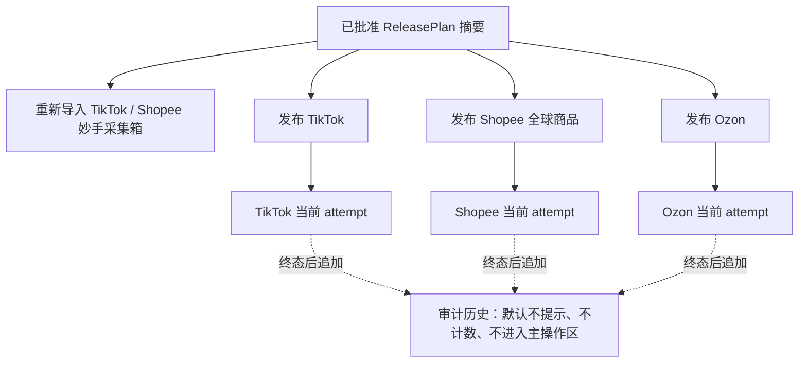

主页面只有批准计划、必要的两步采集箱动作、三个独立平台按钮和三个当前 attempt 投影。历史完整保留，但不在主页面主动提示。

### 2.2 前端状态

替换全局 `oneClickExecution` 的平台共享运行字段，使用：

```javascript
platformExecutions = {
  TIKTOK: {
    currentAttempt: null,
    posting: false,
    polling: false,
    error: null,
    requestId: null,
  },
  SHOPEE_GLOBAL: { /* same shape */ },
  OZON: { /* same shape */ },
};
```

页面刷新时分别读取三个 current endpoint。一个平台的 `posting` 不进入其他按钮的 `disabled` 表达式。

### 2.3 按钮可用性

#### TikTok

```text
enabled = plan_approved
       && selected_tiktok_target_count > 0
       && tiktok_draft_proof_ready
       && !tiktok_current_attempt_running
```

#### Shopee 全球商品

```text
enabled = plan_approved
       && shopee_global_selected
       && shopee_input_ready
       && !shopee_current_attempt_running
```

#### Ozon

```text
enabled = plan_approved
       && ozon_selected
       && ozon_input_ready
       && !ozon_current_attempt_running
```

历史数组不得出现在上述表达式中。

### 2.4 禁用原因优先级

1. 未批准计划；
2. 当前计划未选择该平台；
3. 当前平台输入缺失；
4. 当前平台正在执行。

每个原因对应一个动作：批准计划、选择平台、重新导入/补全输入、查看当前 attempt。

## 3. 命令 API

### 3.1 通用请求

```json
{
  "offer_id": "3846511157",
  "plan_id": "omnichannel:...",
  "confirmation_token": "server-issued-token",
  "publication_targets": ["tiktok:LH_PH"],
  "confirm_publish": true,
  "request_id": "client-generated-uuid"
}
```

要求：

- `confirm_publish` 必须为 literal boolean `true`；
- `request_id` 在同一次浏览器点击的网络重放中保持不变；
- 客户端不得提供 detail ID、shop ID、command、proof 或 receipt；
- `publication_targets` 必须与已批准计划复核，不能扩大范围。

### 3.2 接受响应

HTTP `202`：

```json
{
  "ok": true,
  "accepted": true,
  "platform": "TIKTOK",
  "attempt": {
    "schema_version": "platform-publish-attempt/v2",
    "attempt_id": "publish-attempt:...",
    "attempt_number": 4,
    "status": "QUEUED",
    "plan_id": "omnichannel:...",
    "platform": "TIKTOK",
    "target_count": 6,
    "terminal": false
  },
  "external_writes_performed": []
}
```

`202` 仅表示本地持久任务创建成功。此响应阶段不得已经在请求线程内调用妙手。

### 3.3 同平台执行中

HTTP `409`：

```json
{
  "ok": false,
  "error": {
    "code": "PLATFORM_ATTEMPT_IN_PROGRESS",
    "platform": "TIKTOK"
  },
  "current_attempt": { "attempt_id": "...", "status": "RUNNING" },
  "external_writes_performed": []
}
```

UI 只显示“该平台正在执行，请等待本次结束”的可见提示；不得聚焦、跳转、打开详情、清空页面，也不得改变其他平台按钮。

### 3.4 当前输入缺失

TikTok 草稿 proof 缺失返回 `409 TIKTOK_DRAFT_PROOF_MISSING`，下一步为 `REIMPORT_TIKTOK_COLLECTBOX`。错误文本不得引用上一次发布成败。

## 4. 查询 API

### 4.1 当前尝试

```http
GET /api/product-workspace/platform-publish-current
    ?plan_id={plan_id}&platform=TIKTOK
```

返回该平台唯一非终态 attempt；不存在时 `current_attempt=null`。

### 4.2 历史

```http
GET /api/product-workspace/platform-publish-history
    ?plan_id={plan_id}&platform=TIKTOK&limit={explicit_audit_limit}
```

按 `attempt_number DESC` 返回终态尝试。历史接口不返回 `start_allowed`，避免 UI 把历史当准入权威。主发布页面默认不调用此接口来显示历史条数或提示。

### 4.3 查询与命令的页面关系

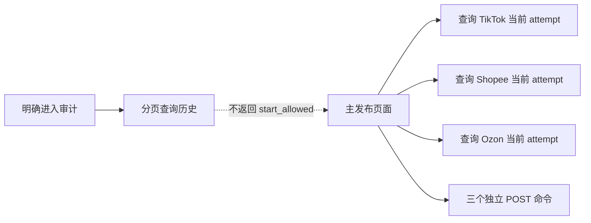

## 5. 服务端创建尝试算法

```text
start_platform_attempt(request, platform):
  1. validate request shape
  2. rebuild exact approved ReleasePlan
  3. derive platform targets from server-owned plan
  4. validate platform-current input proof
  5. BEGIN IMMEDIATE
  6. find nonterminal attempt for (plan_id, platform)
     - if found: return PLATFORM_ATTEMPT_IN_PROGRESS
  7. check request_id
     - if already exists: return same attempt
  8. allocate attempt_number = max + 1
  9. insert PlatformPublishAttempt(QUEUED)
 10. insert TargetAttempt(PENDING) for exact platform targets
 11. append ATTEMPT_CREATED event
 12. COMMIT
 13. wake platform worker
 14. return 202, external_writes=[]
```

禁止步骤：读取上一终态并据此拒绝；重置上一 attempt 的目标行；把上一 attempt 改回 `PENDING`。

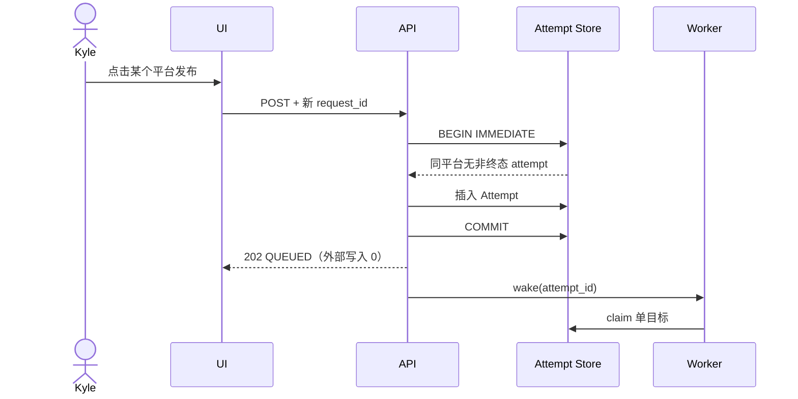

### 5.1 同平台重复点击

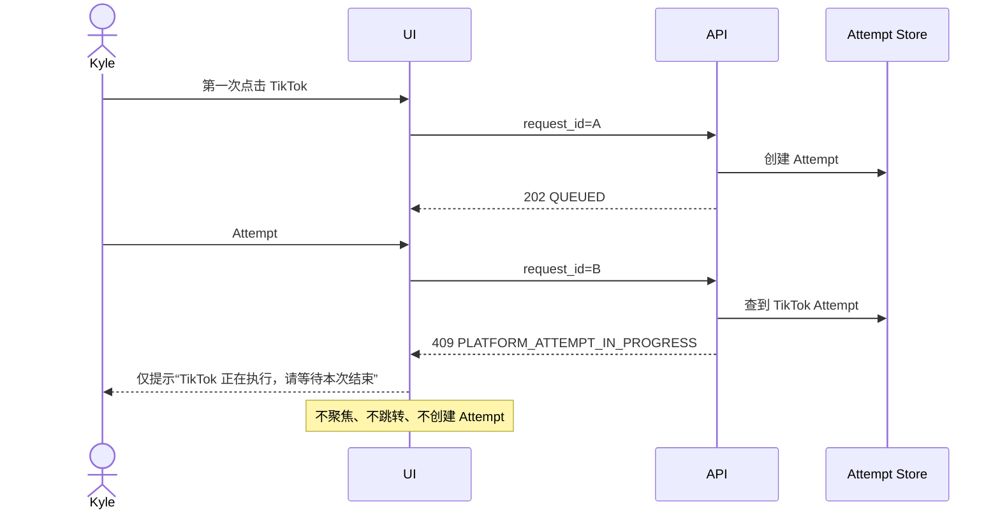

## 6. TikTok 执行设计

### 6.1 目标集合

从已批准计划中选择全部 `tiktok:*` 目标，保持计划顺序。当前已覆盖：

- `tiktok:LH_PH`
- `tiktok:LH_MY`
- `tiktok:LH_TH`
- `tiktok:LH_VN`
- `tiktok:MX`
- `tiktok:GB`
- 计划明确选择的 HomeBloom TikTok 目标

不得硬编码“只处理六个”而遗漏计划中的其他 TikTok 目标。

### 6.2 输入绑定

每个目标的 command 由服务端使用以下事实构造：

- 已批准计划；
- 最新有效采集箱导入批次；
- 该目标 exact detail/shop identity；
- 该目标已批准价格；
- 该目标类目决定；
- 该目标图片、标题、SKU、重量与尺寸；
- 目标策略版本。

command 必须 JSON 可序列化，不能包含 callback、client、token 或原始响应。

### 6.3 TikTok 严格两步流程

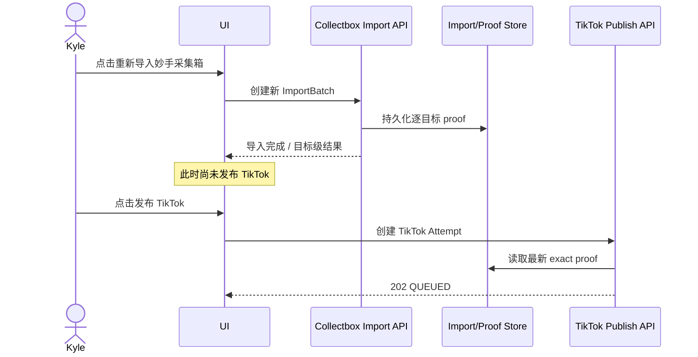

若 proof 缺失，“发布 TikTok”只说明先完成重新导入；不得自动执行导入，也不得在一次点击中串联导入和发布。

### 6.4 GB 特例

GB 暂时跳过草稿与批准内容的价格、类目和内容一致性比较；仍校验：

- 目标确实为 `tiktok:GB`；
- shop ID 绑定为已配置 GB 店铺；
- detail ID 存在并来自当前导入批次；
- 请求仍绑定当前批准计划。

GB 不得因“上一次未发布”被排除在新 attempt 之外。

### 6.5 Worker 循环

```text
for target in attempt.targets ordered by ordinal:
  if target is terminal: continue
  prepare target from persisted current-attempt input
  if proven pre-submit failure:
      record PRE_SUBMIT_FAILED
      continue
  atomically mark DISPATCHING + write intent
  call save_move_collect_task exactly once
  if accepted:
      record MIAOSHOU_ACCEPTED
  elif response outcome is unknowable:
      record OUTCOME_UNKNOWN
  else:
      record PRE_SUBMIT_FAILED only when zero external invocation is proven
  continue
finalize attempt aggregate
```

## 7. Shopee 全球商品执行设计

- attempt 目标固定为 `shopee:GLOBAL`，前提是计划包含 Shopee 范围；
- 读取已批准英文标题、简易描述、图片、SKU、模型、重量、尺寸和价格事实；
- 通过妙手创建或更新一个 CNSC 全球商品；
- 本版本到全球商品即结束；
- 不创建 PH/MY/TH/VN 站点发布任务；
- 不读取 TikTok 目标结果；
- 妙手接受后记为 `MIAOSHOU_ACCEPTED`，页面说明“不代表国家站点已发布”。

## 8. Ozon 执行设计

- attempt 目标为 `ozon:RU`；
- 使用计划中的 Ozon 事实和妙手目标绑定；
- 不读取 TikTok 采集箱状态；
- 不读取 Shopee 全球商品状态；
- 不读取当前雅仓库存作为发布 gate；
- 缺少 Ozon 自身必填输入时，只返回 Ozon 当前输入错误。

## 9. 结果聚合

### 9.1 单目标终态

| 内部状态 | 页面文本 | 可再次新建 attempt |
| --- | --- | --- |
| `MIAOSHOU_ACCEPTED` | 妙手已接受提交；不代表店铺最终上架 | 是 |
| `PRE_SUBMIT_FAILED` | 未提交到妙手；可再次发布 | 是 |
| `OUTCOME_UNKNOWN` | 提交结果未知；可再次发布 | 是 |

### 9.2 Attempt 终态

- 所有目标 `MIAOSHOU_ACCEPTED`：`COMPLETED`；
- 任一目标失败或未知：`COMPLETED_WITH_ERRORS`；
- attempt 终态不改变下一 attempt 的准入。

## 10. 历史展示设计

历史是持久审计能力，不是主发布页面的默认组成部分。主发布页面：

- 不显示历史条数；
- 不弹出历史提示；
- 不用“上次失败/上次未确认”占据当前执行区；
- 不因历史变化重新计算按钮。

当用户明确进入审计视图时，历史卡片标题必须包含：

- 平台；
- attempt number；
- 发起时间；
- 完成时间；
- 目标汇总；
- “仅历史记录，不影响新发布”。

历史中的目标可分组为“妙手接受”“未提交”“结果未知”，但这些分组不得复用到主操作区。

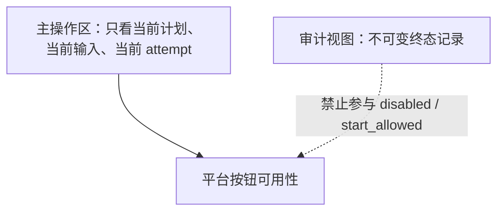

## 11. 错误码

| 错误码 | 作用域 | 是否外写 | 下一步 |
| --- | --- | --- | --- |
| `PLAN_NOT_APPROVED` | 当前平台请求 | 0 | 批准计划 |
| `PLAN_IDENTITY_DRIFT` | 当前平台请求 | 0 | 刷新计划 |
| `PLATFORM_NOT_SELECTED` | 当前平台请求 | 0 | 修改并重新批准计划 |
| `TIKTOK_DRAFT_PROOF_MISSING` | TikTok | 0 | 重新导入采集箱 |
| `PLATFORM_ATTEMPT_IN_PROGRESS` | 单平台 | 0 | 查看当前 attempt |
| `MIAOSHOU_AUTH_UNAVAILABLE` | 单目标/单平台 | 0 | 恢复妙手配置 |
| `MIAOSHOU_REQUEST_REJECTED` | 单目标 | 明确计数 | 再次新建 attempt |
| `MIAOSHOU_OUTCOME_UNKNOWN` | 单目标 | 上下界 | 人工查看或再次新建 attempt |
| `LOCAL_PERSISTENCE_FAILED` | 单平台 | 依事实 | 显示服务端恢复状态 |

## 12. 测试设计

### 12.1 修改前红测永久集

| 测试 ID | 场景 |
| --- | --- |
| `RED-HISTORY-001` | 上一批混合成功/失败/未知后，新点击仍创建新 TikTok attempt |
| `RED-ISOLATION-001` | TikTok RUNNING 时 Shopee 与 Ozon 可点击 |
| `RED-ISOLATION-002` | Shopee 失败不改变 TikTok/Ozon 按钮 |
| `RED-CONTINUE-001` | TikTok 中间目标失败，后续目标仍提交 |
| `RED-UI-001` | 历史变化不改变按钮 disabled |
| `RED-UI-002` | 每个禁用按钮有可见原因和下一步 |
| `RED-UI-003` | 点击任一可用按钮必产生网络请求或明确同步反馈 |
| `RED-RESTART-001` | 服务重启恢复当前 attempt，终态后按钮开放 |
| `RED-TRUTH-001` | 妙手接受不显示“店铺上架成功” |

这些测试进入长期回归套件，后续所有发布修改必须运行。

### 12.2 测试层次

1. 纯状态与准入单元测试；
2. SQLite 真实事务集成测试；
3. HTTP handler 到 worker 的纵向测试；
4. 妙手 transport fixture fault matrix；
5. 真实 Chromium 桌面/窄屏测试；
6. 独立测试线程验收；
7. 经明确授权后才进行真实外部平台验收。

### 12.3 每次改动的固定门禁

1. 新问题稳定复现；
2. 新红测在修改前失败；
3. 记录失败输出；
4. 修复；
5. 新红测变绿；
6. 永久红测集全部通过；
7. 相关后端测试通过；
8. Chromium 真实交互通过；
9. 独立验收；
10. 服务重启并确认运行版本 commit。

## 13. 增量实施顺序

### Step 1：历史与当前解耦

仅改变状态投影和 UI：历史不再影响按钮；不改妙手 payload。Kyle 测试后再继续。

### Step 2：平台 busy 状态隔离

移除全局 UI `posting` 对三个按钮的联动。Kyle 测试两个平台可并行启动。

### Step 3：TikTok 新 attempt 实体

每次点击新建 attempt，不重置旧目标行。保留现有妙手提交路径。

### Step 4：Shopee 全球商品新 attempt

只到全球商品，不扩展站点。

### Step 5：Ozon 新 attempt

完全隔离。

每一步都必须有独立任务卡、修改前红测、focused/full/browser 结果和 Kyle 实测确认。

## 14. 当前实现逐步审计（基线 `88309c7`）

本节只描述现状，不代表 V2 目标需求。

### 14.1 页面加载与历史进入主操作区

1. `render(data)` 取得 dashboard 后调用 `renderReleaseV1(data)`。
2. `ensureOneClickExecution(data)` 使用 `offer_id + plan_id + revision` 建立页面执行上下文。
3. 如果 dashboard 带有已持久化 job，页面把它放入全局 `oneClickExecution.job`。
4. `renderOneClickExecution()` 遍历这个 job 的当前目标投影。
5. 目标按 `SUCCEEDED/SUBMITTED_UNVERIFIED/RECONCILIATION_REQUIRED/BLOCKED_*` 分到“妙手已接受”“上次结果未确认”“上次未发布”等分组。
6. 因而页面加载后，用户首先看到的是同一 job 的上一轮可变投影，而不是一个空的新尝试区。

这解释了截图中“上次结果未确认”为什么出现在发布主区：它是 UI 投影设计，不是 Kyle 提出的业务要求。

### 14.2 当前三个按钮

页面已有三个独立路由：

- TikTok -> `/api/product-workspace/publish-tiktok`
- Shopee 全球商品 -> `/api/product-workspace/publish-shopee-global`
- Ozon -> `/api/product-workspace/publish-ozon`

但它们共同经过 `publishPlatformBatch()`，并共享：

- `releaseSubmitting`
- `oneClickExecution.posting`
- `oneClickExecution.job`
- `oneClickExecution.error`
- 同一个状态轮询器

因此“路由分开”并不等于“运行状态完全隔离”。当前任一平台进入 posting 时，三个按钮都会被同一个前端 busy 状态禁用。

### 14.3 TikTok 点击前检查

`updateReleasePrimaryAction()` 只在采集箱投影存在 `TIKTOK publishable=true` 时启用 TikTok 按钮。服务端又执行两次只读核对：

1. 采集箱平台结果是否可发布；
2. 最新采集箱批次是否保存了逐目标内部 detail/shop proof。

第二项是最近 bridge 增加的当前输入要求。旧采集箱收据没有这些内部字段时，必须重新导入一次。这是 schema 迁移造成的“当前输入缺失”，不是“上一次发布失败导致下一次不能发布”。

### 14.4 服务端创建当前批次

三个路由进入 `_start_oneclick_release()`：

1. 校验 `confirm_publish=true`；
2. 重建并核对已批准 `ReleasePlan`；
3. TikTok 额外核对采集箱当前输入；
4. 在一个进程级 `_release_execution_lock` 内启动/读取 ReleaseRun；
5. `ensure_job()` 为该计划取得一个长期 one-click job；
6. 根据按钮选择 `TIKTOK`、`SHOPEE_GLOBAL` 或 `OZON` 目标范围；
7. `start_explicit_batch()` 在同一个 job 上把本次范围设为 active；
8. job 的 `batch_sequence` 加一；
9. 本次 active 目标的可变字段被重置为 `PENDING`；
10. 唤醒 worker 并返回 HTTP 202。

`start_explicit_batch()` 的注释已明确：以前成功、失败或需要对账的目标可以进入下一次显式 batch。也就是说，后端目标是允许重发的；问题主要在于它用“重置同一 job 投影”表达新尝试，使历史与当前难以区分。

### 14.5 当前正在执行时

如果同一 job 的 active 目标存在 `DISPATCHING`：

- `start_explicit_batch()` 不覆盖它；
- 服务端发现返回的 active scope 与本次请求 scope 不同后，返回 `platform_dispatch_in_progress`；
- 这是并发保护。

但因为所有平台共享同一 job、进程锁和前端 posting 状态，这个必要的“同平台防双击”可能扩大为不必要的“跨平台等待”。V2 要把锁粒度缩到平台。

### 14.6 Worker 与目标结果

Worker 对 active scope 执行：

1. prepare 持久 JSON-only command 和 proof；
2. 原子 claim 单目标；
3. adapter 调用妙手；
4. 明确接受写 `SUBMITTED_UNVERIFIED`；
5. 提交前失败写 `FAILED_PRE_SUBMIT` 或 `BLOCKED_*`；
6. 调用后无法判定写 `RECONCILIATION_REQUIRED`；
7. 单目标结束后继续领取下一个目标。

当前终态结果和 write receipts 是追加保存的，但 UI 主要展示 job 当前投影，没有把不可变 attempt 历史作为独立产品对象展示。

### 14.7 上一次结果当前究竟影响什么

| 场景 | 当前是否影响下一次 | 说明 |
| --- | --- | --- |
| 上一次 `FAILED_PRE_SUBMIT` | 后端不应阻止 | `start_explicit_batch()` 可重置本次目标 |
| 上一次 `RECONCILIATION_REQUIRED` | 后端不应阻止 | 当前 MVP 测试明确允许显式新 batch |
| 上一次 `SUBMITTED_UNVERIFIED` | 后端不应阻止 | 用户明确允许再次提交 |
| 上一次 `SUCCEEDED` | 后端不应阻止 | 用户明确允许再次提交 |
| 当前同平台仍 `DISPATCHING` | 暂时阻止 | 防止并发双击；终态后解除 |
| 旧采集箱批次缺新 proof | TikTok 当前输入阻止 | 一次性 schema 迁移问题，不是上次发布结果 |
| UI 显示“上次...”分组 | 视觉上强烈影响 | 当前/历史混排，属于 V2 明确差距 |

因此，“上次结果影响下一次”不是 Kyle 的需求。当前实现中，终态历史在后端原则上已经允许新 batch，但数据模型和 UI 仍把上一轮投影带入当前主流程，形成了相反的产品感受和部分跨平台副作用。

## 15. 真实页面基线与控件编号

以下图片直接截取自 `http://127.0.0.1:8765/new-product?offer_id=3846511157` 的真实页面，不是设计稿。

[查看完整真实视口截图](assets/live-approved-release-current-state.png)

### 15.1 妙手采集箱区域

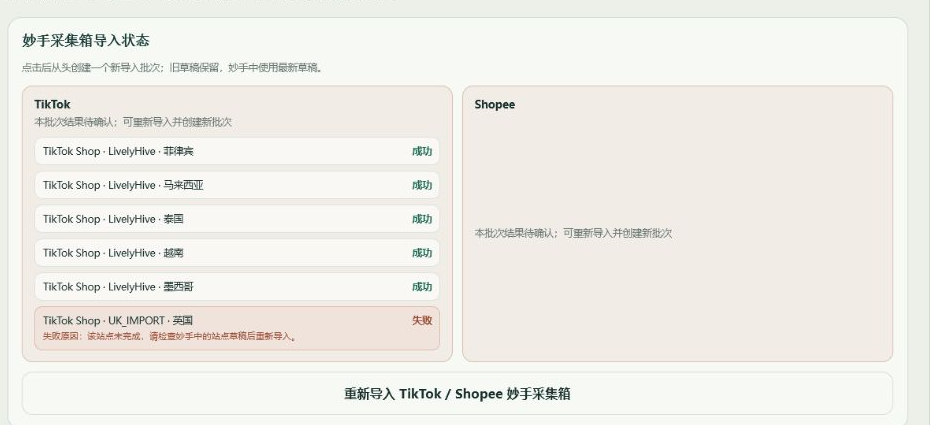

### 15.2 三个平台按钮与“本轮执行状态”

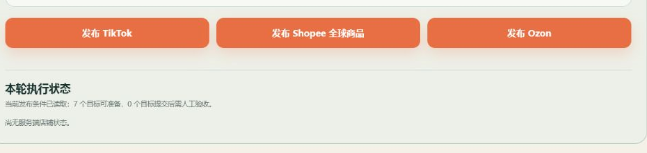

当前截图中的“尚无服务端店铺状态”是已确认的现状缺陷：最近一次 TikTok attempt 已有服务端终态结果，但前端把终态 job 排除后又退回 preview 文案。

### 15.3 控件编号

| 编号 | 当前可见文字 | DOM | 类型 | 所属阶段 |
| --- | --- | --- | --- | --- |
| BTN-PLAN-APPROVE | 批准当前发布计划 | `#approveReleasePlanButton` | 命令 | 上游批准 |
| BTN-COLLECTBOX | 导入/重新导入 TikTok / Shopee 妙手采集箱 | `#collectboxActionButton` | 命令 | 两步流程第 1 步 |
| BTN-PUBLISH-TK | 发布 TikTok | `#releasePrimaryActionButton` | 命令 | 两步流程第 2 步 |
| BTN-PUBLISH-SP | 发布 Shopee 全球商品 | `#shopeeGlobalReleaseButton` | 命令 | Shopee 独立发布 |
| BTN-PUBLISH-OZ | 发布 Ozon | `#ozonReleaseButton` | 命令 | Ozon 独立发布 |
| BTN-CATEGORY-SAVE | 保存当前类目决定 | `.channel-category-decision-form button[type=submit]` | 本地批准 | 动态恢复控件 |
| BTN-GLOBAL-APPROVE | 批准 Shopee Global 计划 | `.shopee-global-plan-approval-form button[type=submit]` | 本地批准 | 动态恢复控件 |
| BTN-OBSERVE-ACCEPT | 记录已验证观察警告 | `.oneclick-observation-review-form button[type=submit]` | 本地结案 | 动态结果控件 |
| BTN-MANUAL-VERIFY | 记录 Kyle 人工验收 | `.manual-verification-form button[type=submit]` | 本地结案 | 动态结果控件 |
| BTN-READ-RETRY | 重新读取状态/发布条件 | 由 `canonical_next_action` 动态生成 | 只读查询 | 读取失败恢复 |

本轮评审必须覆盖上述所有按钮。任何以后新增的发布区域按钮都必须先加入本表，再允许实现。

## 16. 每个按钮背后的完整代码逻辑

### 16.1 通用调用分层

```mermaid
flowchart LR
    B["可见按钮"] --> L["DOM click/submit listener"]
    L --> V["前端本地校验"]
    V --> H["HTTP 请求"]
    H --> S["modules/products/server.py 路由"]
    S --> D["服务端身份与计划复核"]
    D --> TX["SQLite 事务/持久 attempt"]
    TX --> W["worker / adapter"]
    W --> M["妙手 API 或本地结案"]
    M --> R["持久 receipt/status"]
    R --> Q["GET status 轮询"]
    Q --> UI["本轮执行状态"]
```

任何按钮文档必须同时说明 `B/L/V/H/S/D/TX/W/M/R/Q/UI`；只说明路由或只说明 UI 均不算完整。

### 16.2 BTN-PLAN-APPROVE：批准当前发布计划

| 项 | 当前实现 |
| --- | --- |
| 监听器 | `#releasePlanForm submit` → `approveReleasePlan()` |
| 点击前条件 | `eligible_for_plan_approval=true`；存在 `plan.plan_id`；未在提交 |
| 请求 | `POST /api/product-workspace/release-plan/approve` |
| body | `currentReleaseBody({approved_by:"Kyle", user_approved:true})`；含 offer、seller SKU、精确 targets、plan ID、confirmation token |
| 服务端入口 | `modules/products/server.py::_approve_release_plan_locally` |
| 外部写入 | `0`；只保存本地不可变计划批准事实 |
| 成功反馈 | dashboard 重载；“当前 ReleasePlan 已由 Kyle 批准并持久化；没有发生外部写入。” |
| 失败反馈 | 使用服务端 dashboard 重载 blocker；显示具体错误和“刷新后重新核对计划” |
| 对其他按钮影响 | 成功后显示 BTN-COLLECTBOX、BTN-PUBLISH-TK、BTN-PUBLISH-SP、BTN-PUBLISH-OZ |

禁用原因依次为：已批准无需重复操作、正在批准、计划当前 blocker。禁用控件必须把原因显示在可见状态区；不能只写入 `data-disabled-reason`。

### 16.3 BTN-COLLECTBOX：导入/重新导入采集箱

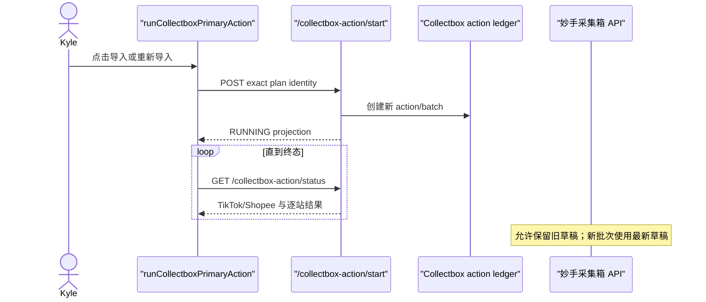

| 项 | 当前实现 |
| --- | --- |
| 监听器 | click → `runCollectboxPrimaryAction()` |
| 前端准入 | 有 identity、projection；不在 posting；`start_allowed=true`；next action 为 `start_collectbox_action` 或 `restart_collectbox_action` |
| 首次 body | `confirm_collectbox_action=true`、`approved_by=Kyle`、offer、plan、revision、payload digest、confirmation token、targets digest |
| 重开 body 增量 | `restart_collectbox_action=true`、浏览器生成 `reimport_request_id` |
| 请求 | `POST /api/product-workspace/collectbox-action/start` |
| 服务端入口 | `_start_collectbox_action()` |
| 状态读取 | `GET /collectbox-action/preview`；RUNNING 后轮询 `GET /collectbox-action/status` |
| 外部动作 | 分别创建/更新 TikTok 与 Shopee 妙手采集箱草稿；不是正式发布到店铺 |
| 成功后 | 按平台显示结果；TikTok 额外显示逐站成功/失败；按钮变为“重新导入…” |
| 部分失败 | 成功站点保留；失败站点显示原因；允许明确创建下一批次 |
| 读取失败 | 显示“导入状态读取失败”；继续只读轮询，不伪造终态 |
| 快速双击 | `posting=true` 时第二次不发 POST；必须有可见“正在导入”反馈 |

按钮文字完整变体：

| 条件 | 文字 | 是否可点 | 辅助状态 |
| --- | --- | --- | --- |
| 尚未取得 preview | 正在读取妙手采集箱状态 | 否 | 正在读取 TikTok 与 Shopee 状态 |
| READY | 导入 TikTok / Shopee 妙手采集箱 | 是 | 点击一次，分别导入 |
| RUNNING | 正在导入妙手采集箱 | 否 | 页面只读同一持久任务 |
| SUCCEEDED/PARTIAL_FAILED 且可重开 | 重新导入 TikTok / Shopee 妙手采集箱 | 是 | 新批次；旧草稿保留 |
| 合同/身份阻断 | 暂不可导入妙手采集箱 | 否 | 服务端稳定错误码对应文案 |

### 16.4 三个平台发布按钮的公共当前代码

三个按钮目前都进入 `publishPlatformBatch(endpoint, platformName)`：

1. 读取 `oneClickExecution.identity`。
2. `currentReleaseBody({confirm_publish:true})` 生成请求体。
3. 设置全局 `releaseSubmitting=true`、`oneClickExecution.posting=true`。
4. `boundedJsonFetch()` 发送 POST。
5. 只接受 HTTP `202`、`accepted=true`、`external_writes_performed=[]`。
6. 校验 `oneclick-release-status/v1` job。
7. 保存到全局 `oneClickExecution.job`。
8. 立即调用 `scheduleOneClickStatusPoll()`。
9. POST 错误时显示“本次已结束；可以再次点击一键发布”。

当前缺陷：第 3、7、8 步是三个平台共享的前端状态；目标设计必须改为每平台独立状态对象。

公共请求体当前字段：

| 字段 | 来源 | 客户端能否自定义业务内容 |
| --- | --- | --- |
| `offer_id` | dashboard product | 否 |
| `seller_sku` | dashboard candidate | 否 |
| `publication_targets` | 当前本地选择 | 只能回显；服务端必须收窄到按钮平台 |
| `plan_id` | approved ReleasePlan | 否 |
| `confirmation_token` | approved ReleasePlan | 否 |
| `confirm_publish` | 固定 literal `true` | 否 |

客户端不得传入妙手 detail ID、shop ID、API payload、价格覆盖、类目覆盖、adapter command 或 receipt。

### 16.5 BTN-PUBLISH-TK：发布 TikTok

| 项 | 当前实现/目标约束 |
| --- | --- |
| 监听器 | click → `runTiktokReleaseAction()` → `publishSelectedTargets()` |
| 请求 | `POST /api/product-workspace/publish-tiktok` |
| 服务端入口 | `_start_tiktok_release()` |
| 当前额外准入 | 最新 collectbox projection 中 `TIKTOK publishable=true` |
| 服务端精确目标 | 当前已批准 TikTok 六站；不得混入 Shopee/Ozon |
| attempt | 每次明确点击创建新的 TikTok attempt；同平台非终态时只返回当前 attempt |
| worker | 按目标独立准备与提交；单站失败继续下一站 |
| 外部动作 | 妙手站点草稿/正式任务及 `save_move_collect_task` 路径，按批准计划写价格、类目等已绑定字段 |
| 结果 | 每站独立：妙手接受、提交前失败、结果不确定、未提交 |
| 官方回读 | 当前版本不等待；“妙手接受”不等于店铺上架成功 |
| 其他平台 | TikTok posting/status 不得禁用 Shopee/Ozon |

按钮可用公式目标：

```text
enabled = plan_approved
       && selected_tiktok_target_count > 0
       && current_tiktok_collectbox_proof_ready
       && !tiktok_current_attempt_nonterminal
```

历史状态与最近终态结果不得进入该公式。

### 16.6 BTN-PUBLISH-SP：发布 Shopee 全球商品

| 项 | 当前实现/目标约束 |
| --- | --- |
| 监听器 | click → `runShopeeGlobalReleaseAction()` |
| 请求 | `POST /api/product-workspace/publish-shopee-global` |
| 服务端入口 | `_start_shopee_global_release()` |
| 精确范围 | 只创建 Shopee 全球商品；不发布各国家站点 |
| 输入 | approved Shopee title/description/images/models/logistics/price/policy 的 server-owned command |
| attempt | 每次点击是新的 Shopee attempt；与 TikTok/Ozon 分离 |
| 外部动作 | 当前版本通过妙手创建/更新全球商品，不调用原 Shopee direct publish 路径 |
| 结果文案 | 只能说妙手已接受全球商品任务；不得说各站点已发布 |
| 其他平台 | Shopee 任意结果不得禁用 TikTok/Ozon |

### 16.7 BTN-PUBLISH-OZ：发布 Ozon

| 项 | 当前实现/目标约束 |
| --- | --- |
| 监听器 | click → `runOzonReleaseAction()` |
| 请求 | `POST /api/product-workspace/publish-ozon` |
| 服务端入口 | `_start_ozon_release()` |
| 精确范围 | 只包含 `ozon:RU` |
| attempt | 每次点击是新的 Ozon attempt；与 TikTok/Shopee 分离 |
| 外部动作 | 通过妙手 Ozon 发布路径；不调用 TikTok/Shopee |
| 输入缺失 | 只禁用 Ozon 并给出下一步；不得扩大为整页阻断 |
| 其他平台 | Ozon posting/status 不得禁用 TikTok/Shopee |

### 16.8 动态本地批准与结案按钮

| 控件 | 触发函数 | HTTP | 外部写入 | 结果 |
| --- | --- | --- | --- | --- |
| BTN-CATEGORY-SAVE | `submitShopeeCategoryDecision()` | channel category approval route | 0 | 保存当前类目决定；重新计算当前输入 |
| BTN-GLOBAL-APPROVE | `submitShopeeGlobalPlanApproval()` | `/shopee-global-plan-approval` | 0 | 保存当前 Global 计划批准 |
| BTN-OBSERVE-ACCEPT | `submitOneClickObservationAcceptance()` | `/release-target/manual-verify` | 0 | 把已验证 warning 从人工待验收结案；不重发 |
| BTN-MANUAL-VERIFY | `submitManualTargetVerification()` | `/release-target/manual-verify` | 0 | 保存 Kyle 的店铺人工核对；不重发 |
| BTN-READ-RETRY | `retryOneClickReadOnly()` 或 preview/status GET | GET only | 0 | 重新读取，不创建 attempt |

这些按钮不得被三个平台发布按钮隐式代点。发布、批准、人工验收、只读刷新必须保持可区分的审计动作。

## 17. “本轮执行状态”完整变体

### 17.1 “本轮”归属规则

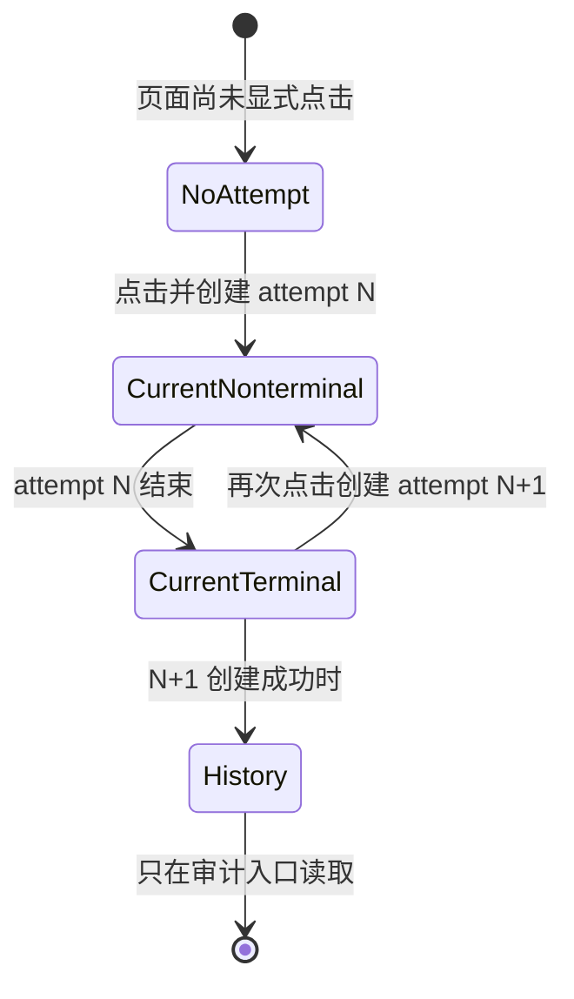

关键规则：`CurrentTerminal` 仍必须显示在“本轮执行状态”。当前代码的 `isCurrentOneClickAttempt()` 把 terminal 判为非本轮，是本次已确认 Bug 的直接前端根因。

### 17.2 顶部摘要变体

| 编号 | 页面条件 | 必须显示的摘要 | 禁止显示 |
| --- | --- | --- | --- |
| ST-000 | 没有 attempt | 尚未开始发布；请选择平台 | “尚无服务端店铺状态”作为含糊终态 |
| ST-010 | POST 发送中 | 正在创建 `{platform}` 发布任务 | 已发布成功 |
| ST-020 | 202 已接受 | `{platform}` 批次已接受，正在读取结果 | 店铺已上架 |
| ST-030 | 有 PENDING/PREPARING | 本轮正在准备：`n/m` | 历史失败提示 |
| ST-040 | 有 DISPATCHING | 本轮正在提交到妙手：`n/m` | 自动重试承诺 |
| ST-100 | 全部妙手接受 | 本轮已结束：`n` 个妙手已接受 | `n` 个店铺发布成功 |
| ST-110 | 混合终态 | 本轮已结束：`a` 接受、`b` 未确认、`c` 未发布 | 尚无服务端状态 |
| ST-120 | 全部提交前失败 | 本轮已结束：`n` 个未发布 | 店铺失败但可以误认为未点击 |
| ST-130 | 全部结果未知 | 本轮已结束：`n` 个结果未确认 | 自动重发中 |
| ST-200 | POST 明确未创建 | 本次未创建发布任务：`reason` | 把旧 attempt 当本轮 |
| ST-210 | POST 响应未知、GET 找到 | 已恢复本轮 `{platform}` 批次 | 再创建一个 attempt |
| ST-220 | POST 响应未知、GET 未找到 | 暂无法确认任务是否创建；只读复核中 | “未发送任何请求” |
| ST-230 | status GET 失败 | 暂时无法读取本轮状态；下面为最后已知状态 | 清空所有卡片 |
| ST-300 | 同平台仍执行又点击 | `{platform}` 当前批次仍在执行，请等待本轮结束 | 跳转、聚焦或创建第二批次 |

### 17.3 单目标卡片变体

| 服务端 status | 标题 | 解释 | 是否代表店铺上架 |
| --- | --- | --- | --- |
| `PENDING` | 等待准备 | worker 尚未准备 command | 否 |
| `PREPARING` | 准备中 | 正在生成/校验 server-owned command | 否 |
| `READY` | 可执行 | 已具备当前 attempt 输入 | 否 |
| `DISPATCHING` | 正在提交到妙手 | 外部调用边界已进入 | 否 |
| `SUCCEEDED` | 妙手已接受提交 | 仅表示妙手返回接受且本地 receipt 已保存 | 否 |
| `SUCCEEDED_MANUAL_REVIEW` | 妙手已接受，待人工核对 | 有 warning；不自动重发 | 否 |
| `SUBMITTED_UNVERIFIED` | 妙手已接受，未做官方回读 | 当前 API-less 目标常见终态 | 否 |
| `FAILED_PRE_SUBMIT` | 本次未发布 | 已证明外部写入为 0 | 否 |
| `RECONCILIATION_REQUIRED` | 本次结果未确认 | 可能已经写入；本轮不自动重发 | 未知 |
| `BLOCKED_AUTH` | 本次未发布：认证不可用 | 该目标 0 写 | 否 |
| `BLOCKED_CAPABILITY` | 本次未发布：能力/输入不可用 | 该目标 0 写 | 否 |
| `BLOCKED_SOURCE_IDENTITY` | 本次未发布：来源身份不成立 | 该目标 0 写 | 否 |
| `BLOCKED_SKU_LINEAGE` | 本次未发布：SKU 血缘不成立 | 该目标 0 写 | 否 |

### 17.4 当前 Offer 的真实对照

当前服务端最近 TikTok attempt 的事实是：

| 目标 | 终态 | 真正含义 |
| --- | --- | --- |
| `tiktok:LH_PH` | `SUBMITTED_UNVERIFIED` | 妙手接受；未证明店铺上架 |
| `tiktok:MX` | `SUBMITTED_UNVERIFIED` | 妙手接受；未证明店铺上架 |
| `tiktok:LH_MY` | `RECONCILIATION_REQUIRED` | 调用后结果不确定 |
| `tiktok:LH_TH` | `RECONCILIATION_REQUIRED` | 调用后结果不确定 |
| `tiktok:LH_VN` | `RECONCILIATION_REQUIRED` | 调用后结果不确定 |
| `tiktok:GB` | `BLOCKED_CAPABILITY` | 本轮未提交 |

因此真实摘要应是：**本轮已结束：2 个妙手已接受，3 个结果未确认，1 个未发布。** 当前页面显示“尚无服务端店铺状态”不符合已知事实。

## 18. 可视化测试实现要求

完整用例表见 [VISUAL_TEST_PLAN.md](VISUAL_TEST_PLAN.md)。这里冻结测试架构。

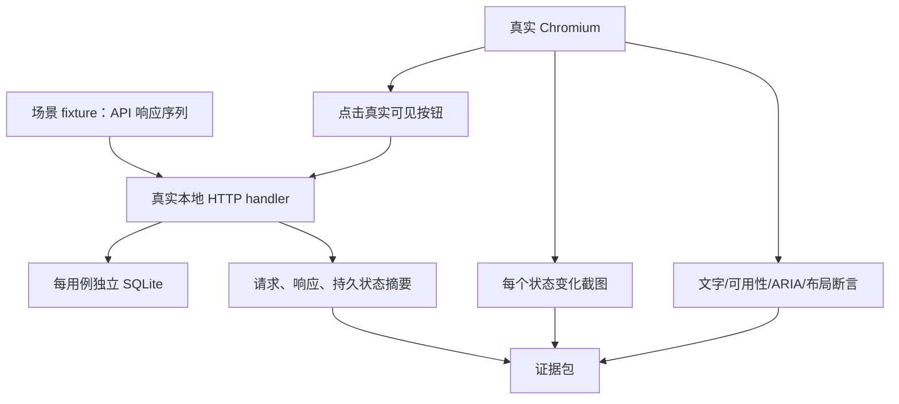

### 18.1 不允许替代真实点击的测试方式

以下测试可以保留，但不能单独作为页面验收：

- 直接调用 `runTiktokReleaseAction()`；
- 直接修改 `oneClickExecution.job`；
- 只执行 jsdom；
- 只断言 HTML 中存在按钮；
- 只测 server handler；
- 只测 adapter 返回值。

真实浏览器必须通过按钮的可访问名称定位并 `click()`，再观察实际 HTTP 和页面变化。

### 18.2 截图门禁

每个用例、每个视口至少保存：

1. 点击前；
2. 点击后立即反馈；
3. HTTP 接受或拒绝后；
4. 每个不同 phase；
5. 最终页面。

相同 phase 的重复轮询不重复截图，避免无意义证据膨胀。截图文件与 `path.json` 中的 phase 顺序必须一一对应。

### 18.3 永久红测

本次已确认缺陷必须先形成：

```text
Given 最近一次 TikTok attempt 已终态且含 2 接受/3 未确认/1 未发布
When 页面加载并读取 preview/status
Then “本轮执行状态”显示精确 2/3/1
And 六个目标卡片都可见
And 不显示“尚无服务端店铺状态”
And 三个平台按钮按各自输入独立可用
```

该测试修复前必须失败；修复后与发布相关的每次改动都必须重复运行。
