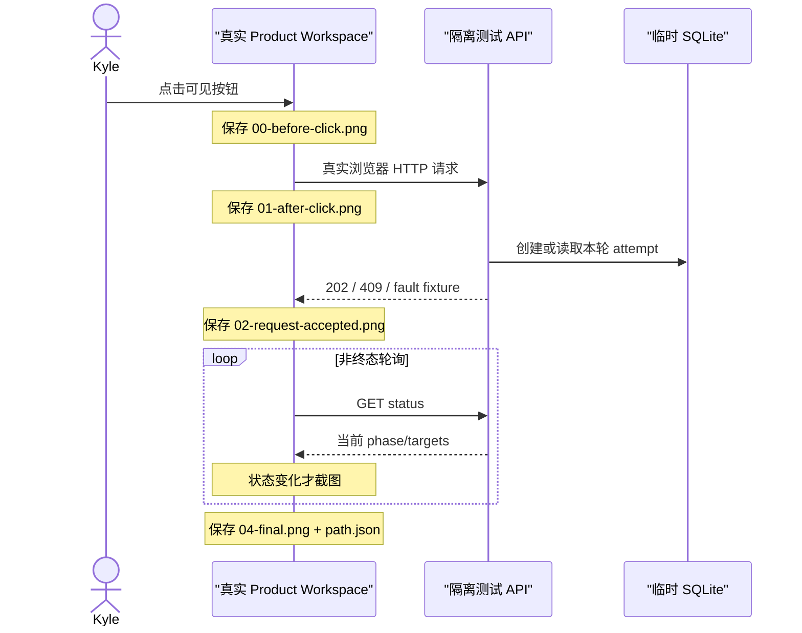

# 自动上品发布 V2：可视化路径测试规范

状态：`DRAFT_FOR_KYLE_REVIEW`

## 1. 测试目标

本规范回答两个问题：

1. 自动测试能否像 Kyle 一样点击真实页面按钮？——能，必须通过真实 Chromium 点击可见控件。
2. Kyle 能否看清每条路径如何被验证？——能，每条用例必须输出按时间排序的页面截图和机器可读路径清单。

默认测试边界：隔离 SQLite、fixture adapter、拦截的妙手响应，正式妙手/店铺写入为 `0`。

## 2. 每条用例的证据包

```text
test-results/release-v2/<case-id>/<viewport>/
  00-before-click.png
  01-after-click.png
  02-request-accepted.png
  03-running.png                 # 只有发生该状态时存在
  04-final.png
  path.json
  browser.log
```

`path.json` 固定字段：

```json
{
  "case_id": "VBT-PUB-005",
  "viewport": "1440x900",
  "clicked_label": "发布 TikTok",
  "request": {
    "method": "POST",
    "path": "/api/product-workspace/publish-tiktok",
    "body_digest": "sha256:..."
  },
  "responses": [
    {"status": 202, "schema_version": "oneclick-release-status/v1"}
  ],
  "polls": [
    {"phase": "RUNNING"},
    {"phase": "BLOCKED"}
  ],
  "final_ui": {
    "summary": "本轮已结束：2 个妙手已接受，3 个结果未确认，1 个未发布",
    "buttons_enabled": ["发布 TikTok", "发布 Shopee 全球商品", "发布 Ozon"]
  },
  "console_errors": [],
  "page_errors": [],
  "external_writes": 0
}
```

禁止在证据包中保存 confirmation token、凭据、原始妙手响应、商品文案全文或外部商品 ID。

## 3. 截图检查点



截图必须来自被测页面，不得用设计稿、静态 HTML 或人工拼图代替。

## 4. 按钮路径矩阵

### 4.1 发布计划批准

| 用例 | 初始条件 | 点击 | 模拟结果 | 最终页面必须显示 |
| --- | --- | --- | --- | --- |
| VBT-APR-001 | 计划可批准 | 批准当前发布计划 | 200 | Kyle 已批准；执行区出现 |
| VBT-APR-002 | 计划不可批准 | 禁用按钮 | 无请求 | 可见的具体原因与下一步 |
| VBT-APR-003 | 请求失败 | 批准当前发布计划 | 409/500 | 失败原因；计划未伪装为已批准 |

### 4.2 重新导入采集箱

| 用例 | 初始条件 | 服务端序列 | 最终页面必须显示 |
| --- | --- | --- | --- |
| VBT-IMP-001 | 首次可导入 | READY → RUNNING → SUCCEEDED | 两平台逐项结果；按钮变“重新导入…” |
| VBT-IMP-002 | 六站中一站失败 | RUNNING → PARTIAL_FAILED | 成功/失败站点分别显示；可重新导入 |
| VBT-IMP-003 | 旧批次存在 | restart 202 → SUCCEEDED | 新批次结果；旧草稿不成为阻断 |
| VBT-IMP-004 | POST 失败 | 409/500 | “导入请求失败”；没有伪造 RUNNING |
| VBT-IMP-005 | 状态 GET 暂时失败 | GET fail → GET success | 可见读取失败，后续恢复并显示结果 |
| VBT-IMP-006 | 快速双击 | 第一次 202，第二次无 POST | 只创建一个导入批次 |

### 4.3 发布 TikTok

| 用例 | 目标结果 fixture | 最终摘要 | 再次点击 |
| --- | --- | --- | --- |
| VBT-TK-001 | 六站全部 `SUBMITTED_UNVERIFIED` | 6 个妙手已接受 | 创建新 attempt |
| VBT-TK-002 | 2 接受 + 3 未确认 + 1 未发布 | 精确显示 2/3/1，逐站可见 | 创建新 attempt |
| VBT-TK-003 | 第一个目标提交前失败，其余接受 | 失败目标与成功目标并列 | 创建新 attempt |
| VBT-TK-004 | 中间目标 dispatch 未知，其余继续 | 未确认目标不阻止后续目标 | 创建新 attempt |
| VBT-TK-005 | POST 202 后轮询 | 请求中→运行中→最终 | 终态前只防同平台双击 |
| VBT-TK-006 | 同平台仍运行时再次点击 | 409/current attempt | 只提示，不跳转、不聚焦 |
| VBT-TK-007 | TikTok 草稿 proof 缺失 | 409 | 提示先重新导入；Shopee/Ozon 可点 |
| VBT-TK-008 | POST 响应超时，status 找到 job | timeout→GET current | 恢复该 attempt，不创建第二个 |
| VBT-TK-009 | POST 响应超时，status 无 job | timeout→null | 明确未确认；按钮按设计恢复 |
| VBT-TK-010 | 本轮刚终态 | status terminal | 终态结果仍留在“本轮执行状态” |
| VBT-TK-011 | 终态后创建下一轮 | attempt N→N+1 | N 转历史；主区只显示 N+1 |

### 4.4 发布 Shopee 全球商品

| 用例 | 初始条件 | 最终断言 |
| --- | --- | --- |
| VBT-SP-001 | TikTok 失败/未知 | Shopee 仍能 202；只创建 Shopee attempt |
| VBT-SP-002 | 全球商品提交接受 | 显示“妙手已接受”，不声称站点已发布 |
| VBT-SP-003 | global 写后 regional 不执行 | 写入计数与阶段真实，不伪报零写 |
| VBT-SP-004 | 当前输入缺失 | 仅 Shopee 提示；TikTok/Ozon 不受影响 |
| VBT-SP-005 | 同平台双击 | 一个 attempt；第二次只提示 |

### 4.5 发布 Ozon

| 用例 | 初始条件 | 最终断言 |
| --- | --- | --- |
| VBT-OZ-001 | TikTok/Shopee 任意终态 | Ozon 仍能独立 202 |
| VBT-OZ-002 | Ozon 输入就绪 | 只创建 Ozon attempt |
| VBT-OZ-003 | Ozon 输入缺失 | 只禁用/提示 Ozon |
| VBT-OZ-004 | 同平台双击 | 一个 attempt；第二次只提示 |

## 5. “本轮执行状态”变体测试

| 用例 | 状态 | 页面标题/摘要 | 卡片 | 按钮规则 |
| --- | --- | --- | --- | --- |
| VBT-ST-001 | 尚未点击 | 尚未开始发布 | 无 | 三个平台按各自输入启用 |
| VBT-ST-002 | 正在创建 | 正在创建 TikTok 发布任务 | 无或骨架 | 只禁 TikTok |
| VBT-ST-003 | 已接受待执行 | TikTok 批次已接受 | PENDING/PREPARING | 只禁 TikTok |
| VBT-ST-004 | 正在提交 | 正在提交到妙手 | DISPATCHING | 只禁 TikTok |
| VBT-ST-005 | 全部接受 | 本轮已结束：6 个妙手已接受 | 6 张接受卡 | 三平台可按输入再次点击 |
| VBT-ST-006 | 混合终态 | 本轮已结束：2 接受、3 未确认、1 未发布 | 精确六张卡 | 三平台可按输入再次点击 |
| VBT-ST-007 | 本地请求失败 | 本次未创建发布任务 | 错误摘要 | 当前平台恢复可点击 |
| VBT-ST-008 | 状态读取失败 | 暂时无法读取本轮状态 | 保留最后已知卡片并标陈旧 | 不用历史替代当前事实 |
| VBT-ST-009 | 服务重启恢复 | 已恢复本轮 TikTok 批次 | 当前持久状态 | 只按当前非终态禁用 |
| VBT-ST-010 | 新 attempt 开始 | 正在创建新的 TikTok 发布任务 | 清空旧本轮卡片 | 旧 attempt 转历史 |

## 6. 视觉断言

两个视口都检查：

- 按钮可见、可聚焦、可点击；
- 禁用按钮旁有可见原因；
- 状态变化在 `aria-live` 区域可被读屏获取；
- 卡片顺序稳定且不随响应数组排列变化；
- 文案不得使用“成功发布到店铺”表示仅被妙手接受；
- 不出现“尚无服务端店铺状态”覆盖已知终态结果；
- 不出现横向滚动条；
- 截图中不显示 token、凭据或原始响应。

## 7. 现状红测

当前 Offer `3846511157` 已提供真实复现：服务端最近 TikTok 批次有 2 个 `SUBMITTED_UNVERIFIED`、3 个 `RECONCILIATION_REQUIRED`、1 个 `BLOCKED_CAPABILITY`，但页面显示“尚无服务端店铺状态”。

对应永久红测为 `VBT-TK-010` + `VBT-ST-006`。修复前必须失败；修复后必须显示最近本轮终态，且三个发布按钮仍可再次发起。
